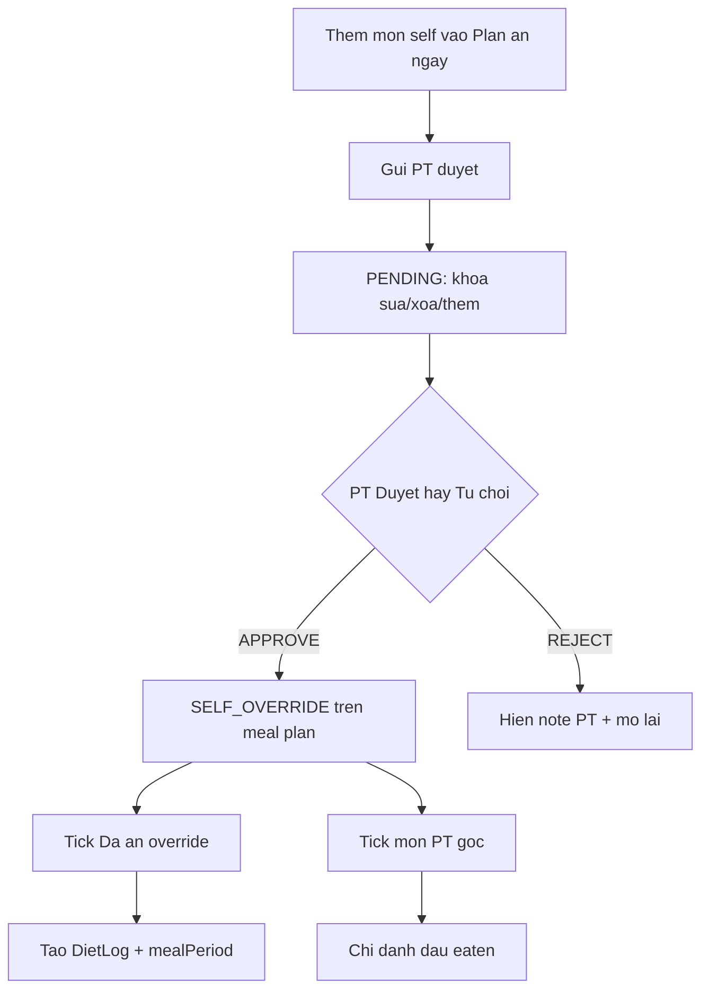

# Tổng hợp: Mức vận động + Nhật ký 5 buổi + Plan ăn ngày + Duyệt PT

> **Mục đích:** Giải thích đầy đủ những gì đã làm (sprint meal-windows / self-plan + siết `meal_period`), để BA/dev/tester hiểu luồng, rule, và **trường hợp biên**.  
> **Cập nhật:** 2026-07-20 · Phản ánh code hiện tại (không phải bản nháp cũ).  
> **Deep-test:** [deep-test-2026-07/SUMMARY.md](./deep-test-2026-07/SUMMARY.md)

---

## 0. Bản đồ nhanh — đừng nhầm 3 lớp dữ liệu

| Lớp | Là gì | Ví dụ |
|-----|--------|--------|
| **Plan ăn ngày** | Kế hoạch “sẽ ăn” trong ngày (self + PT) | Card *Plan ăn ngày* trên Diet Tracker |
| **Nhật ký (DietLog)** | Đã ghi nhận ăn thật | Tab AI / Manual → log dưới |
| **Meal plan tuần (PT)** | Thực đơn publish theo tuần | Workspace PT |

**Không cộng đôi macro:** thanh mục tiêu = **đã ghi (actual)** + **phần plan chưa ăn (planned)**. Slot đã có món self/override đã tick → không cộng lại phần plan trùng.

---

## 1. Onboarding + Tiến độ & Mục tiêu — Mức độ vận động

### 1.1 User thấy gì

Sau đăng ký / hoàn thiện hồ sơ, và trên trang **Tiến độ & Mục tiêu dinh dưỡng** (`/macro-targets`):

- Dropdown **Mức độ vận động hàng ngày** với nhãn tiếng Việt (không hiện `SEDENTARY` khô):
  - Ít vận động — văn phòng, ≤ 1 buổi/tuần (R = 1.2)
  - Vận động nhẹ — 1–3 buổi/tuần (R = 1.375)
  - Vận động vừa — 3–5 buổi/tuần (R = 1.55)
  - Vận động nhiều — 6–7 buổi/tuần (R = 1.725)
  - Vận động rất nặng — VĐV / tập 2 lần/ngày (R = 1.9)
- Icon **(i)** cạnh label: hover/focus → bảng giải thích + công thức **TDEE = BMR × R**.
- Nút **Áp dụng & tính lại macro**: confirm trước khi ghi đè mục tiêu calo/đạm/tinh bột/béo cũ.
- **Settings** và **Profile** có link vào `/macro-targets` để chỉnh lại.

### 1.2 Hệ thống làm gì

| Bước | Chi tiết |
|------|----------|
| Lưu | `User.activity_level` (enum `ActivityLevel`) |
| Onboarding | Gửi `activityLevel`; fallback legacy `activityFactor` nếu map đúng hệ số; không rõ → `MODERATE` |
| Tính lại | `POST /api/v1/profile/recalculate-macros` — bắt buộc `activityLevel`; lấy cân nặng mới nhất → BMR → TDEE → chia macro → ghi `MacroTarget` trong 1 transaction |
| Gợi ý | `GET /api/v1/profile/macro-suggestion` ưu tiên `activityLevel` request, rồi level đã lưu |

### 1.3 File chính

- FE: `activityLevelOptions.jsx`, `OnboardingPage.jsx`, `MacroTargetsPage.jsx`, `SettingPage.jsx`
- BE: `ActivityLevel.java`, `MacroSuggestionCalculator.java`, `ProfileExtensionsController`, `OnboardingServiceImpl`, `RecalculateMacrosRequest/Response`

### 1.4 Trường hợp biên

| Tình huống | Hành vi |
|------------|---------|
| Enum sai / không parse được | 400 (GlobalExceptionHandler) |
| Factor legacy không khớp bảng | BadRequest khi resolve |
| Chưa có body metric | Recalculate phụ thuộc cân nặng mới nhất — thiếu → lỗi nghiệp vụ theo service |
| User đổi level nhưng không bấm Áp dụng | Chỉ đổi UI; macro cũ giữ nguyên đến khi confirm + API thành công |

---

## 2. Nhật ký ăn uống — Chọn ngày

### 2.1 UI

- Mũi tên **← →** đổi ngày.
- Nút lịch mở `DietDateCalendar` (chọn ngày + chấm ngày có log).
- URL `?date=YYYY-MM-DD` đồng bộ.

### 2.2 Rule ngày

| Loại ngày | Ghi nhật ký (AI/Manual) | Plan ăn ngày | Tick Đã ăn |
|-----------|-------------------------|--------------|------------|
| **Hôm nay** | Có (siết khung giờ — mục 3) | Có | Có (trong cửa sổ buổi) |
| **Quá khứ** | Có (chọn đủ 5 buổi, không khóa theo giờ máy) | Thường hạn chế sửa tùy rule BE | Không / hạn chế (ngày đã qua) |
| **Tương lai gần** (cửa sổ plan ~+14 ngày) | **Không** — hiện thông báo không ghi nhật ký được | **Có** — thêm/sửa món để chuẩn bị | **Ẩn** |

`DietDates`: log không được ngày tương lai; plan được hôm nay + tương lai, không được quá khứ khi *tạo* plan mới.

### 2.3 Rule enterprise-ready cho quá khứ

- **Plan quá khứ**: readonly hoàn toàn cho customer (không thêm/sửa/xóa/gửi duyệt/tick).
- **DietLog quá khứ**: **append-only**. Vẫn cho **CREATE** để bù ngày cũ, nhưng **không** cho update/delete log đã tồn tại.
- **PT review self-plan quá khứ**: vẫn cho phép để PT xử lý backlog duyệt trễ.
- **Coaching rời ACTIVE**: hệ thống auto-reject mọi `PENDING` self-plan còn treo với lý do rõ ràng cho customer.

---

## 3. Khung giờ 5 buổi + nhật ký

### 3.1 Năm buổi (Asia/Ho_Chi_Minh)

| Period | Giờ | Map API `mealType` (4 giá trị) |
|--------|-----|--------------------------------|
| MORNING — Buổi sáng | 04:00–10:59 | BREAKFAST |
| NOON — Buổi trưa | 11:00–12:59 | LUNCH |
| AFTERNOON — Buổi chiều | 13:00–17:59 | SNACK |
| EVENING — Buổi tối | 18:00–21:59 | DINNER |
| LATE — Buổi khuya | 22:00–03:59 (qua nửa đêm) | SNACK |

**Vấn đề cũ (đã sửa):** AFTERNOON và LATE cùng `SNACK` → không lưu buổi thật → tick khuya lúc sáng lại hiện dưới **Buổi chiều**.

**Sửa tận gốc:** cột **`meal_period`** trên `SelfPlanItem`, `MealPlanItem`, `DietLog` (SoT). FE group nhật ký theo `mealPeriod` trước; null thì fallback derive cũ (không crash).

### 3.2 AI vs Manual — **luật hiện tại (đã siết)**

> Bản mô tả sản phẩm sớm hơn từng viết: *“Manual chọn được mọi khung trong ngày”*.  
> **Đã đổi có chủ đích:** khi `isToday`, **Manual giống AI** — chỉ khung **hiện tại** (khóa quá khứ + tương lai).  
> Bù bằng field **`makeup_for_period`** (xem 3.3). Ghi bù *đổi ngày* vẫn dùng lịch sang ngày quá khứ.

| Bề mặt | Hôm nay | Ngày quá khứ đang xem |
|--------|---------|------------------------|
| **AI** | Chỉ current; analyze/confirm/create validate BE | Chọn period của ngày đó; không ép = current wall-clock |
| **Manual** | Chỉ current + optional makeup | Chọn bất kỳ trong 5 buổi |

### 3.3 Makeup (bù buổi đã quên — cùng ngày)

- Cột DB: `makeup_for_period` (**ENUM/varchar**, không phải JSON).
- Payload: `makeupForPeriod` (camelCase).
- Log vẫn thuộc **`meal_period` = khung đang ghi** (current); makeup chỉ là metadata “bù cho buổi X”.
- BE 400 nếu: makeup = current, = mealPeriod, hoặc chưa qua trong hôm nay; chỉ cho `logDate == todayVn`.
- Trước 04:00 (đang nửa khuya): danh sách buổi “đã qua” **rỗng** (tránh bù Sáng/Trưa khi chưa tới).
- UI: select “Bù cho…” + chip **Bù: Buổi …** trên card log.

### 3.4 File chính

- FE: `dietUtils.js`, `FoodInputCard.jsx`, `DietTrackerPage.jsx`, `MealSection.jsx`
- BE: `MealPeriod.java`, `MealPeriods.java`, `DietLogServiceImpl`, `MealAnalysisServiceImpl`, `DietLogController` (`meal_period`, `makeup_for_period`)

---

## 4. Plan ăn ngày (Day plan + self-plan)

### 4.1 User làm được gì

Trên Diet Tracker, card **Plan ăn ngày**:

1. Chọn buổi (5 buổi) → search thực phẩm → nhập gram → Thêm.
2. Sửa gram / xóa món self (khi không bị khóa review).
3. Preview macro “sẽ ăn” đẩy lên `NutritionProgress` (live).
4. **Không có PT:** tick **Đã ăn** trên món self → tạo DietLog (copy `mealPeriod`).
5. **Có PT:** không tick trực tiếp món self — phải **Gửi PT duyệt**; PENDING → khóa thêm/sửa/xóa; **Hủy gửi** → mở lại.
6. Sau PT **APPROVE**: món self đè đúng bữa trong plan PT (`SELF_OVERRIDE`); tick override → tạo log; tick món **PT gốc** → chỉ đánh dấu eaten, **không** tạo log mới.
7. **REJECT**: hiện note PT; mở lại chỉnh sửa self.
8. Ngày tương lai: thêm/sửa plan được; ẩn Đã ăn.

### 4.2 Gate “Đã ăn” (siết giờ)

Công thức chung FE + BE (`isMealPeriodOpen`):

```text
LATE:
  (planDate == hôm nay AND giờ >= 22)
  OR (planDate == hôm qua AND giờ < 4)
Khác LATE:
  planDate == hôm nay AND đang trong cửa sổ giờ của buổi đó
```

| Tình huống | Kết quả |
|------------|---------|
| Plan Khuya tối thứ Hai, tick 01:00 thứ Ba | **Cho phép** (cross-midnight) |
| Cùng plan, tick 05:00 thứ Ba | Chặn |
| Plan Khuya hôm nay, tick 21:00 | Chặn (chưa tới 22h) |
| Plan Khuya, tick 10:55 sáng | Chặn + không tạo log nhầm chiều |
| `mealPeriod == null` (data cũ SNACK) | Chặn — “thiếu khung giờ; sửa/thêm lại” |
| Tạo plan lúc 01:00 | `planDate = todayVn()` (thứ Ba), **không** suy ngược về thứ Hai |

**Tick trễ trong ngày:** nếu buổi đã qua nhưng vẫn là **hôm nay**, customer vẫn được tick với điều kiện nhập `lateTickReason` tối thiểu 10 ký tự. Lý do này hiển thị lại cho PT/cả customer trên item hoặc log tương ứng.

Backfill: `scripts/backfill_meal_period.sql` (BREAKFAST/LUNCH/DINNER rõ; SNACK để null).

### 4.3 API chính (customer)

- `GET /api/v1/diet/day-plan?date=`
- `POST/PUT/DELETE .../self-plan` (+ mark eaten)
- `POST .../self-plan/submit`, cancel submission

### 4.4 Trường hợp biên self-plan

| Tình huống | Hành vi |
|------------|---------|
| Gửi duyệt ngày quá khứ | 400 |
| Chưa có PT plan publish ngày đó | 400 |
| Double submit PENDING | 409 (`pendingUniqueKey`) |
| Có PT mà cố markEaten self | 400 — phải duyệt trước |
| Approve | Xóa item PT cũ cùng **`mealPeriod`**/ngày → insert `SELF_OVERRIDE` + copy `mealPeriod` |

---

## 4b. Coaching (Meal plan tuần) — 5 buổi + dual-metric

Màn **Coaching** (`/coaching`) hiển thị thực đơn PT publish theo **tuần** (week picker), không có calendar +14 ngày như Nhật ký.

| Khía cạnh | Hành vi |
|-----------|---------|
| **Section UI** | **5 buổi** theo `MEAL_PERIODS` (Buổi sáng / trưa / chiều / tối / khuya) — **không gộp SNACK** |
| **Section trống** | Ẩn (không render khung rỗng) |
| **Tick Đã ăn** | Gate `isMealPeriodOpen` — chỉ trong khung giờ buổi đó |
| **Bulk skip** | "Không ăn cả bữa" gửi `mealPeriod` → chỉ skip món cùng buổi (AFTERNOON ≠ LATE) |
| **Toast tick** | `SELF_OVERRIDE` → *"Đã ghi vào nhật ký"*; `PT_ORIGINAL` → *"Đã đánh dấu tuân thủ (chưa ghi nhật ký)"* |
| **Dual-metric** | Tuân thủ = tick trên plan; Nhật ký calo = chỉ từ `SELF_OVERRIDE` / DietLog — **không đổi** |

Tooltip header ngày: *Tick trong khung giờ buổi đó. Nhật ký calo ghi ở Nhật ký ăn uống / Plan ăn ngày.*

File chính: `MealPlanWeekView.jsx`, `CoachingPage.jsx`, `dietUtils.js` (`resolvePlanItemPeriod`, `isMealPeriodOpen`).

BE skip/unskip cả bữa: `PUT .../meals/skip|unskip` nhận optional `mealPeriod` (fallback `mealType` nếu null).

---

## 4c. PT duyệt self-plan — đường vào + verify

| Bước | Chi tiết |
|------|----------|
| **Đường vào** | Login PT → **Học viên** (`/pt/clients`) → badge *Self-plan chờ duyệt* → **Thực đơn tuần** (`/pt/clients/:id/meal-plan`) |
| **List PENDING** | `SelfPlanSubmissionReviewList` — nhãn buổi từ `MEAL_PERIOD_LABELS` |
| **Empty state** | Card hướng dẫn khi không có submission chờ duyệt |
| **Duyệt** | Override theo **`mealPeriod`** scope (MORNING-only không xóa NOON/EVENING/…) |
| **Từ chối** | Bắt buộc `ptNote`; unlock self items; giữ menu PT gốc |

### Checklist verify (manual QA)

**Setup:** `pt.certified@gmail.com` / `123456` → Demo Coached → Thực đơn tuần. Fixture V2 seed 2 PENDING: **ngày +1** (chỉ MORNING — duyệt), **ngày +2** (EVENING — từ chối).

1. **Duyệt (+1):** Trước/sau — slot MORNING = `SELF_OVERRIDE`; các buổi khác vẫn `PT_ORIGINAL`. List PENDING biến mất **không reload**.
2. **Từ chối (+2):** Nhập lý do → PT plan không đổi; customer DayPlan hiện note; self items unlock.
3. **Badge ClientList** cập nhật sau mỗi action.
4. **Customer** `demo.coached@nutrican.com`: Coaching tuần chứa ngày +1 thấy MORNING override.
5. **Bulk skip Coaching:** "Không ăn cả bữa" Buổi chiều **không** skip Buổi khuya.

Reset fixture: `DELETE FROM system_settings WHERE setting_key IN ('DEMO_VETERAN_FIXTURES_V1','DEMO_VETERAN_FIXTURES_V2');` → restart BE.

---

## 5. Mục tiêu hàng ngày (live)

`NutritionProgress` bên phải:

- **Actual** từ summary nhật ký ngày đang xem.
- **Planned** từ DayPlanCard (`onPlannedTotalsChange`) — món chưa eaten.
- Badge / message vượt macro khi projected vượt ngưỡng (~20% calo — mirror control loop FE).

---

## 6. Phía PT — Duyệt self-plan

### 6.1 UI

- Trang meal plan / workspace: list yêu cầu **PENDING** của client đang chọn.
- **Duyệt** / **Từ chối** (từ chối **bắt buộc** ghi lý do).

### 6.2 API

- `GET /api/v1/workspace/self-plan-submissions`
- `PUT /api/v1/workspace/self-plan-submissions/{id}` — `action` + `ptNote`

### 6.3 Sau quyết định

- APPROVE → `applySelfPlanSubmission` (override theo bữa) + notify customer.
- REJECT → unlock item self, giữ menu PT gốc + note.
- Clear `pendingUniqueKey`.
- Nếu customer **đã có log đúng món đề xuất** trong cùng buổi: override được set eaten ngay, **không** tạo log lần 2.
- Nếu customer **đã có log món khác** trong cùng buổi: override giữ `eaten=false`, FE hiện trạng thái *"Buổi đã có nhật ký khác - không cần tick lại"* để tránh ngầm hiểu sai macro thực tế.

### 6.4 Buổi đã chốt + smart submit + macro PT

**Buổi đã chốt** (`DayPlanRules.isMealPeriodSettled`) khi một trong các điều kiện:

- Có `DietLog` LOGGED cùng `planDate` + `mealPeriod`
- Món PT / override trong buổi `eaten = true`
- Toàn bộ món PT buổi đó bị skip
- (Phụ) Self item trong buổi đã eaten

| Trạng thái buổi | Customer self đề xuất | PT pending list |
|-----------------|----------------------|-----------------|
| Chưa chốt, draft | Sửa/xóa được | Không thấy |
| Chưa chốt, đã gửi | Khóa (PENDING) | Duyệt/từ chối |
| Đã chốt | Readonly + gạch ngang + badge *Buổi đã chốt — không cần duyệt* | Loại khỏi list |

**Smart day submit:** Nút *Gửi PT duyệt* / ngày — payload chỉ gồm self items thuộc **buổi chưa chốt** (BE `SelfPlanServiceImpl.submit` + FE `DayPlanCard`).

**Macro PT:** `GET /workspace/meal-plans/{clientId}` trả `calories/protein/carb/fat` trên từng item (`MealPlanItemMacrosResolver`: `foodCode` → `foodItemId`). PT UI ưu tiên macro API, không còn 0 kcal khi seed chỉ có `foodItemId`.

**Tick trễ PT:** `ProgressDataDto.lateTickReasons[]` từ `MealPlanItem.lateTickReason` + `DietLog.lateTickReason`; hiển thị tại Client Progress + badge trên meal plan item.

**Demo coached hôm nay:** PT chiều `eaten=true` + self chiều draft (settled) + submission PENDING **chỉ buổi tối**.

---

## 7. Sơ đồ luồng (customer có PT)



---

## 8. Checklist hiểu đúng (đọc trước khi test)

1. **5 buổi UI ≠ 4 mealType API** — chiều/khuya cùng SNACK; SoT là `meal_period`.
2. **Hôm nay AI + Manual chỉ current** — makeup là metadata, không đổi buổi của log.
3. **Khuya qua nửa đêm** chỉ mở cho **tick** plan ngày hôm trước lúc 00–03:59; tạo plan mới vẫn gắn `todayVn()`.
4. **Có PT** ≠ tick self tùy ý; **không PT** tick self → log ngay (trong cửa sổ giờ).
5. **Data cũ SNACK null period** — có thể vẫn sai nhãn nhật ký (fallback); **không tick** đến khi có period.
6. Chạy backfill SQL sau khi BE tạo cột (`ddl-auto=update` hoặc ALTER tương đương).

---

## 9. Liên kết tài liệu / test liên quan

| Tài liệu | Nội dung |
|----------|----------|
| [deep-test-2026-07/B-onboarding-macros.md](./deep-test-2026-07/B-onboarding-macros.md) | ActivityLevel + macro |
| [deep-test-2026-07/C-meal-periods.md](./deep-test-2026-07/C-meal-periods.md) | 5 buổi |
| [deep-test-2026-07/E-day-plan.md](./deep-test-2026-07/E-day-plan.md) | Day plan |
| [deep-test-2026-07/F-selfplan-override.md](./deep-test-2026-07/F-selfplan-override.md) | Self-plan / PT |
| [deep-test-2026-07/G-dietlog.md](./deep-test-2026-07/G-dietlog.md) | Diet log |
| `scripts/backfill_meal_period.sql` | Backfill period |
| `MealPeriodsTest` + `scripts/check-meal-period-utils.mjs` | Gate LATE / SoT |

---

## 11. Tài khoản demo visual QA (fixture ~14 ngày)

**Khác tự register:** có lịch sử nhật ký, cân nặng, plan PT, self-plan đã duyệt/từ chối — không phải account trống.

| Tài khoản | Email | Password | Mở app sẽ thấy |
|-----------|-------|----------|----------------|
| Không PT | `demo.solo@nutrican.com` | `Demo123!` | Lùi lịch 2 tuần → logs theo 5 buổi; Plan tick được; Macro + cân |
| Có PT | `demo.coached@nutrican.com` | `Demo123!` | Plan PT 5 buổi + self draft (Gửi duyệt); lịch sử approve/reject |
| PT | `pt.certified@gmail.com` | `123456` | Client Demo Coached |

Seed: BE `DemoVeteranDataInitializer` lần đầu (`DEMO_VETERAN_FIXTURES_V2`). Self-plan + PT plan **today → today+14**; 2 submission PENDING (ngày +1 duyệt / +2 từ chối). Refresh nhẹ hôm nay: `node scripts/seed-demo-meal-windows.mjs` (full +14d do BE V2).

Chi tiết luồng: xem mục 1–7 và **4b–4c** (Coaching 5 buổi, PT duyệt).

---

## 10. Điểm lệch so với đoạn mô tả sản phẩm bạn dán (cố ý)

| Đoạn mô tả ban đầu | Code hiện tại |
|--------------------|---------------|
| Manual: chọn mọi khung trong ngày để ghi bù | Hôm nay Manual **khóa như AI**; bù bằng `makeupForPeriod` hoặc sang ngày quá khứ trên lịch |
| Chỉ “cảnh báo nhẹ” nếu chọn giờ chưa tới (AI) | Hôm nay **khóa cứng** past + future (không soft-warn cho phép ghi) |
| SNACK → label chiều/khuya theo giờ tạo log | Ưu tiên **`mealPeriod` đã lưu**; fallback giờ chỉ khi null |

Các lệch trên nằm trong plan **Strict meal period gates** (2026-07-20) — sửa đúng bug “plan khuya hiện dưới buổi chiều” và chặn tick ngoài cửa sổ.
