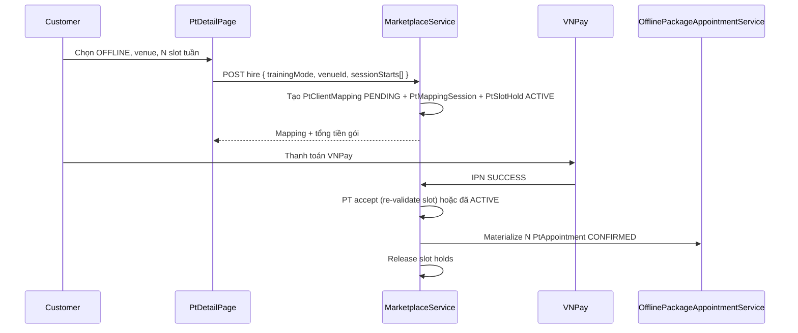

# Feature: Hire PT Offline — Gói đa buổi

> Cập nhật: 2026-07-20  
> Liên quan: [FEATURES.md §6](./FEATURES.md), [API_DOCUMENTATION.md §4](./API_DOCUMENTATION.md), [TONG_HOP_DU_AN_FE_BE.md](./TONG_HOP_DU_AN_FE_BE.md)

## 1. Tổng quan

Khách hàng thuê PT **offline** bằng cách chọn **nhiều buổi tập** trên lịch tuần của PT, địa điểm (venue), và thanh toán **một lần** cho cả gói.

| Chế độ | Đơn giá | `agreedAmount` trên mapping |
|--------|---------|----------------------------|
| **ONLINE** | `onlineRate` / tháng (`MONTH`) | Giá tháng |
| **OFFLINE** | `offlineRate` / buổi (`SESSION`) | `sessionCount × perSessionAmount` |

## 2. Luồng end-to-end



### Trạng thái mapping

| Giai đoạn | Mapping status | Slot holds |
|-----------|----------------|------------|
| Customer gửi hire | `PENDING` | `ACTIVE` (giữ slot) |
| PT reject / payment hết hạn | `REJECTED` / expired | Released |
| PT accept + payment OK | `ACTIVE` | Released sau materialize |
| Kết thúc coaching | `COMPLETED` | — |

## 3. Backend

### Entities mới / mở rộng

| Table | Entity | Vai trò |
|-------|--------|---------|
| `pt_venues` | `PtVenue` | Địa điểm tập offline |
| `pt_availability_windows` | `PtAvailabilityWindow` | Lịch rảnh theo thứ trong tuần |
| `pt_mapping_sessions` | `PtMappingSession` | Buổi trong gói (sequence, start/end, venue snapshot) |
| `pt_slot_holds` | `PtSlotHold` | Giữ slot từ PENDING → payment/lifecycle |
| `pt_client_mappings` | + `sessionCount`, `perSessionAmount` | Metadata gói offline |
| `pt_appointments` | `PtAppointment` | Buổi CONFIRMED sau thanh toán |

### Services chính

| Service | Vai trò |
|---------|---------|
| `PtVenueAvailabilityService` | CRUD venue + availability (KYC + profile API) |
| `PtCalendarService` | Lịch PT: windows, occupied slots, holds |
| `OfflineHireSessionService` | Validate & persist sessions + holds khi hire |
| `SlotHoldService` | Release holds (reject, expiry, success) |
| `OfflinePackageAppointmentService` | Tạo N appointment sau VNPay SUCCESS |
| `CoachingPaymentWindowScheduler` | Hết hạn payment → release holds |

### API

| Method | Path | Mô tả |
|--------|------|--------|
| GET | `/api/v1/marketplace/pts/{ptId}/calendar` | Venues, availability, occupied slots |
| POST | `/api/v1/marketplace/pts/{ptId}/hire` | Hire online hoặc offline |
| GET | `/api/v1/profile/pt/venues` | PT — danh sách venue |
| POST | `/api/v1/profile/pt/venues` | PT — tạo venue |
| PUT | `/api/v1/profile/pt/venues/{id}` | PT — sửa venue |
| DELETE | `/api/v1/profile/pt/venues/{id}` | PT — xóa venue |
| GET | `/api/v1/profile/pt/availability` | PT — lịch tuần |
| PUT | `/api/v1/profile/pt/availability` | PT — thay toàn bộ lịch tuần |

### Request hire offline

```json
POST /api/v1/marketplace/pts/{ptId}/hire
{
  "trainingMode": "OFFLINE",
  "venueId": "uuid-venue",
  "sessionStarts": [
    "2026-07-22T08:00:00",
    "2026-07-24T08:00:00",
    "2026-07-26T08:00:00"
  ]
}
```

## 4. Frontend

| File | Vai trò |
|------|---------|
| `KycPage.jsx` | PT đăng ký: venue + lịch tuần (`PtVenueAvailabilityEditor`) |
| `PtDetailPage.jsx` | Modal hire offline, calendar picker, package summary |
| `PtWeeklyCalendarPicker.jsx` | Multi-select slot theo tuần |
| `offlineHireSlots.js` | Helpers: occupied filter, package total |
| `CoachingPage.jsx` / `ClientListPage.jsx` | Hiển thị gói (sessionCount, perSessionAmount, sessions) |
| `marketplaceService.js` | `getPtCalendar`, `hirePt` với `sessionStarts` |

## 5. Test nhanh (dev seed)

`OfflineHireTestDataInitializer` (profile `dev`):

| Vai trò | Email | Mật khẩu |
|---------|-------|----------|
| PT offline | pt.offline@gmail.com | 123456 |
| Customer | customer3@gmail.com | 123456 |

**Smoke test:**

1. Login `customer3@gmail.com` → Marketplace → PT offline → Hire OFFLINE  
2. Chọn venue + ≥1 slot → gửi hire → `/coaching` thấy gói PENDING  
3. Login PT → accept → customer VNPay (sandbox) → appointments CONFIRMED  

## 6. Lưu ý triển khai

- Restart BE sau deploy để Hibernate tạo bảng `pt_mapping_sessions`, `pt_slot_holds`.
- `PtPortfolioEditor` (sau merge main) dùng flow **yêu cầu cập nhật hồ sơ** — venue/lịch chủ yếu cấu hình lúc **KYC đăng ký** hoặc qua API profile.
- Online hire không dùng `sessionStarts`; offline bắt buộc `venueId` + ít nhất một `sessionStarts`.
