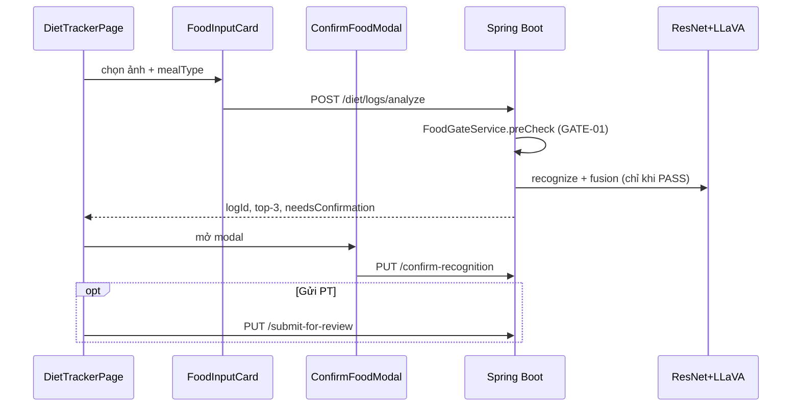

# NutriCan PT — Tài liệu yêu cầu sản phẩm (đầy đủ)

> **Mục đích:** Một file duy nhất mô tả BE + FE hiện có: workflow, logic nghiệp vụ, business rules, BR/FR, constraints, acceptance criteria.  
> **Cập nhật:** 2026-07-07 · Master Spec **v3 + Addendum v3.1** gate green  
> **Source of truth:** [NUTRICAN_PT_MASTER_SPEC_v3.md](./NUTRICAN_PT_MASTER_SPEC_v3.md) · v2 archived: [NUTRICAN_PT_MASTER_SPEC_v2.md](./NUTRICAN_PT_MASTER_SPEC_v2.md)

**Liên quan:** [TONG_HOP_DU_AN_FE_BE.md](./TONG_HOP_DU_AN_FE_BE.md) · [API_DOCUMENTATION.md](./API_DOCUMENTATION.md) · [TESTING_E2E_MATRIX.md](./TESTING_E2E_MATRIX.md) · [TESTING_V2_FLOWS.md](./TESTING_V2_FLOWS.md) · [TEAM_ONBOARDING.md](./TEAM_ONBOARDING.md)

### Hướng dẫn cho AI reviewer

1. Đọc [v3 Trạng thái triển khai](./NUTRICAN_PT_MASTER_SPEC_v3.md#trạng-thái-triển-khai-as-of-2026-07-07) + [Addendum v3.1](./NUTRICAN_PT_GAP_ADDENDUM_v3_1.md#trạng-thái-triển-khai-2026-07-07).
2. Đối chiếu code map: [TONG_HOP](./TONG_HOP_DU_AN_FE_BE.md) §6, §14, §16.1, §17.
3. Chạy tests: `cd nutrican-be; ./mvnw test` (**120**) · `cd nutrican-fe; npm run build` · `cd e2e; npx playwright test tests/` (cần BE:8080).
4. Ma trận AC: [TESTING_E2E_MATRIX.md](./TESTING_E2E_MATRIX.md) (cột Happy/Bad).
5. Drift có chủ đích: dual-state PT review; `INACTIVE` thay `TERMINATED`; ResNet `preCheck` thay LLaVA binary gate.
6. **Addendum v3.1:** ADD-01..08 **closed**. Còn mở: GAP-02; polish E2E (SOS resolve, notification deep-link).

### v3 MVP P1 roadmap (2026-07-06)

| Gap | Epic | MVP P1 | Status |
|-----|------|--------|--------|
| v3-C | Progress timeline + milestones | Yes | Done |
| v3-D | Manual log → PT review | Yes | Done |
| v3-E | Recipe builder | Yes | Done |
| v3-F | Meal plan interactive | Yes | Done |
| v3-G | Post-meal rating | Yes | Done |
| v3-K | RBL diet preference cohort | Yes | Done |
| v3-A | Diet preference filter | Yes | Done |
| v3-B | Control loop + PT alert | Yes | Done |
| v3-H | Smart submit suggestion | Yes | Done |
| v3-I | Dual-state canonical | Yes | Done |
| v3-J | Customer cancel appointment | Yes | Done |

### v3.1 Addendum (2026-07-07)

| ADD | Epic | Status | Key code |
|-----|------|--------|----------|
| ADD-01 | Onboarding wizard | Done | `OnboardingService`, `OnboardingPage` |
| ADD-02 | Body metric logging | Done | `BodyMetricService`, `ProfileExtensionsController` |
| ADD-03 | Chat context | Done | `PtWorkspaceServiceImpl.getChatContext`, `ChatPage` |
| ADD-04 | Marketplace filter | Done | `MarketplaceServiceImpl`, `?search&goalFilter&sort` |
| ADD-05 | SOS SLA | Done | `SosSlaScheduler`, `SosAdminServiceImpl` |
| ADD-06 | Notifications | Done | `NotificationService`, `Header` bell |
| ADD-07 | Coaching lifecycle | Done | `CoachingLifecycleService` |
| ADD-08 | BR-17 enforce | Done | `IntakeControlLoopServiceImpl` |

### v3 Audit QA (2026-07-06)

| Item | Status |
|------|--------|
| Recipe PUT + diet pref warn + allergy on recipe log + `HOME_COOKED_RECIPE` | Done |
| `MealPlanSkipModal`, PT suggestions on meal plan page, weekly summary WS + customer panel | Done |
| Post-meal opt-out (`notificationOptIn.postMealRating`) | Done |
| Admin RBL `experimentCohortKey` filter + `maeByCohortKey` stats | Done |
| BE unit ≥120 + integration flows | Done |
| Playwright 22 spec / 58 cases + v3.1 34 layers | Done |

### v3 — Inventory code chính (đối chiếu nhanh)

| Module | BE | FE |
|--------|----|----|
| Control loop | `IntakeControlLoopServiceImpl`, `IntakeDayStatus` | `NutritionProgress` intake card |
| Diet pref | `DietPrefCheckServiceImpl` | `!PREF` badges, `dietFilter` search |
| Recipe | `UserRecipeServiceImpl`, `RecipeController` | `FoodInputCard` tab Công thức |
| Progress | `ProgressTimelineServiceImpl`, `ClientGoal*` | `ProgressTimelineCard`, `ProfilePage` |
| Meal plan | `MealPlanController`, `PtWorkspaceServiceImpl` | `MealPlanSkipModal`, `PtMealPlanPage` suggestions |
| Post-meal | `DietLogFeedbackServiceImpl` | `PostMealRatingSheet`, opt-out toggle |
| RBL cohort | `RblCohortUtil`, `RblAdminServiceImpl` | `AdminDashboardPage` cohort table |
| WS | `WebSocketSessionService` | `WEEKLY_SUMMARY`, `PT_CLIENT_ALERT` handlers |

### v2 Implementation snapshot (2026-07-06)

| Area | Status |
|------|--------|
| Dual-State (`status` + `reviewStatus`) | Done |
| Food Gate (GATE-01 preCheck + MANUAL_REQUIRED) | Done |
| eKYC toggle, CV/cert tách, resubmit PT | Done |
| Allergy, diet pref, macro suggestion API | Done |
| Meal plan, appointments, refund workflow | Done (BE + PT/customer/admin FE) |
| Test pyramid (120 BE tests, 22 Playwright specs, happy+bad matrix) | Done — [TESTING_E2E_MATRIX.md](./TESTING_E2E_MATRIX.md) |
| Refund WS FE (`REFUND_UPDATE` handler) | Done — `websocketService.js`, Profile + RefundReview reload |
| Admin allergen CRUD `/admin/allergens` | Done — `AllergenMappingPage`, `FoodAllergenMappingController` |
| GAP-04 WS env, GAP-05 RBL @PreAuthorize | Done |

---

## Mục lục

1. [Tổng quan & phạm vi](#1-tổng-quan--phạm-vi)
2. [Stakeholders](#2-stakeholders)
3. [Product Requirements (PRD)](#3-product-requirements-prd)
4. [Business Requirements (BRD)](#4-business-requirements-brd)
5. [Logic nghiệp vụ theo module](#5-logic-nghiệp-vụ-theo-module)
6. [Functional Requirements (FR)](#6-functional-requirements-fr)
7. [Business Rules](#7-business-rules)
8. [Constraints (ràng buộc)](#8-constraints-ràng-buộc)
9. [Workflows end-to-end](#9-workflows-end-to-end)
10. [Acceptance Criteria (AC)](#10-acceptance-criteria-ac)
11. [Kiến trúc BE → FE & inventory file](#11-kiến-trúc-be--fe--inventory-file)
12. [Non-Functional Requirements](#12-non-functional-requirements)
13. [Gap & hạn chế](#13-gap--hạn-chế)
14. [Phụ lục: API map · Traceability](#14-phụ-lục-api-map--traceability)

---

## Inventory — file mới từ merge `main` (2026-07)

### Backend — 6 file Java mới

| File | Vai trò |
|------|---------|
| `common/entity/SystemSetting.java` | Key-value cấu hình hệ thống (PK = `key`) |
| `common/repository/SystemSettingRepository.java` | JPA repo `SystemSetting` |
| `user/controller/SystemSettingController.java` | `GET /settings/require-kyc`, `PUT /admin/settings/require-kyc` |
| `user/dto/CertificationData.java` | DTO lưu JSONB chứng chỉ trên `PtProfile` |
| `user/dto/CertificationRequest.java` | DTO request đăng ký PT (validation) |
| `user/enums/TrainingMode.java` | `ONLINE` \| `OFFLINE` \| `BOTH` |

### Backend — file sửa đáng kể (cùng commit)

| File | Thay đổi chính |
|------|----------------|
| `user/entity/PtProfile.java` | +`experienceStartDate`, `contactPhone`, `trainingMode`, `location`, `rateUnit`, `certifications` JSONB, social URLs, `getYearsOfExperience()` computed |
| `user/dto/PtRegistrationRequest.java` | Form đầy đủ + validation Jakarta |
| `user/service/impl/UserProfileServiceImpl.java` | KYC gate, cert rule CERTIFIED, `uploadCertImage` → MinIO `pt-certs/` |
| `admin/service/impl/PtAdminServiceImpl.java` | **REJECT không suspend `User`** — chỉ `PtProfile` SUSPENDED |
| `admin/dto/PendingPtDto.java` | Admin xem full hồ sơ pending |
| `admin/config/DataInitializer.java` | Seed `REQUIRE_KYC_FOR_PT=false` (dev) |

### Backend — v2 audit (2026-07-06)

| File | Vai trò |
|------|---------|
| `ai/dto/FoodGatePreCheckResult.java` | Kết quả `preCheck`: gate + cached ResNet |
| `ai/service/impl/FoodGateServiceImpl.java` | GATE-01 `preCheck()` ResNet-only trước LLaVA |
| `diet/controller/FoodAllergenMappingController.java` | Admin CRUD `/admin/allergen-mappings` |
| `diet/config/FoodAllergenMappingInitializer.java` | Seed 6 mapping mặc định |
| `user/controller/RefundController.java` | Refund + `REFUND_UPDATE` WebSocket |
| `diet/enums/DietLogStatus.java` | +`MANUAL_REQUIRED` |

### Backend — v3 audit QA (2026-07-06)

| File | Vai trò |
|------|---------|
| `diet/service/impl/IntakeControlLoopServiceImpl.java` | Control loop OVER/UNDER/AT_RISK, PT alert debounce 24h |
| `diet/service/impl/DietPrefCheckServiceImpl.java` | Diet pref warn (search, plan, recipe, log) |
| `diet/service/impl/UserRecipeServiceImpl.java` | Recipe CRUD + macro từ ingredients |
| `diet/service/impl/DietLogFeedbackServiceImpl.java` | Post-meal rating + 3× low-energy PT alert |
| `user/service/impl/ProgressTimelineServiceImpl.java` | Regression, projection, milestones enrich |
| `diet/entity/IntakeDayStatus.java`, `UserRecipe*`, `DietLogFeedback.java` | v3 entities |
| `user/entity/User.notificationOptIn` | JSONB NFR-14 (`postMealRating`) |
| `admin/service/impl/RblAdminServiceImpl.java` | `maeByCohortKey`, export filter cohort |
| `diet/controller/RecipeController.java` | POST/GET/PUT `/diet/recipes` |
| `diet/controller/MealPlanController.java` | suggest/skip + `GET /meal-plans/weekly-summaries` |

### Backend — v3.1 Addendum (2026-07-07)

| File | Vai trò |
|------|---------|
| `user/service/impl/OnboardingServiceImpl.java` | Wizard 3 bước, skip, MacroTarget |
| `user/service/impl/BodyMetricServiceImpl.java` | Body metrics + reminder status |
| `user/controller/ProfileExtensionsController.java` | `/profile/body-metrics`, onboarding |
| `user/scheduler/BodyMetricReminderScheduler.java` | Weekly weight reminder |
| `user/service/impl/CoachingLifecycleServiceImpl.java` | END_REQUESTED → COMPLETED |
| `user/service/impl/NotificationServiceImpl.java` | Notification center + hire email |
| `diet/scheduler/SosSlaScheduler.java` | SOS SLA 4h/24h |
| `workspace/service/impl/PtWorkspaceServiceImpl.java` | `getChatContext` sidebar data |
| `user/service/impl/MarketplaceServiceImpl.java` | `goalFilter`, `search`, compatibility sort |
| `config/RateLimitFilter.java` | Rate limit (disabled localhost dev) |

### Frontend — v3.1 Addendum (2026-07-07)

| File | Vai trò |
|------|---------|
| `pages/customer/OnboardingPage.jsx` | Onboarding wizard |
| `components/common/OnboardingGuard.jsx` | Redirect new users |
| `components/layouts/Header.jsx` | Notification bell |
| `pages/admin/SosTicketsPage.jsx` | SLA tabs, reassign |
| `pages/pt/ChatPage.jsx` | Context sidebar, PDF attach |
| `services/profileExtensionsService.js` | Body metrics API |
| `services/notificationService.js` | Notification center |

### Frontend — file mới

| File | Vai trò |
|------|---------|
| `pages/customer/components/ConfirmFoodModal.jsx` | Modal xác nhận món AI + gram |
| `pages/customer/components/FoodInputCard.jsx` | Tab AI upload / manual ingredient |
| `pages/customer/components/MealSection.jsx` | Danh sách log theo buổi ăn |
| `pages/customer/components/NutritionProgress.jsx` | Vòng macro ngày vs target |
| `pages/customer/components/dietUtils.js` | Labels, macro scale, image URL, helpers |
| `components/common/ImageLightbox.jsx` | Zoom/rotate/download ảnh (cert, meal, chat) |
| `assets/nutrican_logo.png` | Logo |
| `assets/nutrican_hero_mockup.png` | Hero landing |
| `assets/ai_scanner_illustration.png` | Illustration AI |
| `assets/healthy_salad.png` | Marketing asset |
| `pages/admin/AllergenMappingPage.jsx` | Admin CRUD foodCode ↔ allergen (`/admin/allergens`) |
| `pages/pt/PtMealPlanPage.jsx` | Lịch 7 ngày × 4 bữa cho client |
| `pages/pt/ClientProgressPage.jsx` | Donut adherence + calorie + post-meal line chart |
| `pages/customer/components/MealPlanSkipModal.jsx` | Skip meal plan (NO_TIME / DONT_LIKE / …) |
| `pages/customer/components/PostMealRatingSheet.jsx` | Đánh giá sau bữa ăn |
| `pages/customer/components/ProgressTimelineCard.jsx` | Goals, milestones, regression |

### Frontend — file sửa lớn

| File | Thay đổi |
|------|----------|
| `DietTrackerPage.jsx` | Orchestrator ~647 dòng, dùng 5 components |
| `KycPage.jsx` | Wizard KYC + form PT 4 section (~1200+ dòng) |
| `PtVerificationPage.jsx` | Admin duyệt PT + xem cert qua lightbox |
| `LandingPage.jsx`, auth pages, admin/PT pages | UI rebrand đồng bộ |
| `userService.js` | +`uploadCertImage`, `getRequireKycSetting` |

---

## 1. Tổng quan & phạm vi

### 1.1 Vision

**NutriCan PT** — nền tảng theo dõi dinh dưỡng: ảnh bữa ăn + AI (ResNet199 + LLaVA) → macro NutriHome → PT duyệt khi cần.

### 1.2 Stack

| Layer | Công nghệ |
|-------|-----------|
| FE | React 19, Vite, Tailwind, Zustand, Axios, React Router 7 |
| BE | Spring Boot 4.x, Java 17, JPA, PostgreSQL |
| Storage | MinIO (`diet-logs/`, `pt-certs/`, `pt-cvs/`) |
| AI | FastAPI ResNet `:8000` + Ollama LLaVA |
| Auth | JWT + HttpOnly refresh cookie |

### 1.3 IN / OUT

| IN scope | OUT scope |
|----------|-----------|
| Auth email + Google | Mobile native |
| Diet AI + manual + confirm modal | Thanh toán PT |
| Marketplace, chat, PT workspace | Video call |
| KYC VNPT (configurable) + PT onboarding đầy đủ | i18n đa ngôn ngữ |
| Admin, SOS, RBL export | Production migration (`create-drop` dev) |
| UI rebrand + component Diet Tracker | SSE `/workspace/stream` |

---

## 2. Stakeholders

| Persona | Role | Mục tiêu |
|---------|------|----------|
| Customer | `CUSTOMER` | Log ăn, summary, thuê PT |
| PT Certified | `PT_CERTIFIED` | Client, review log, SOS |
| PT Freelance | `PT_FREELANCE` | Tương tự, tier thấp hơn |
| Admin | `ADMIN` | User, PT verify, SOS, RBL |
| Research | Admin + PT | MAE A1.0 vs A1.1 |

---

## 3. Product Requirements (PRD)

### 3.1 Epics

| Epic | Mô tả | Priority |
|------|--------|----------|
| E1 Identity | Auth, profile, macro target | P0 |
| E2 Diet Intelligence | AI analyze, confirm, summary | P0 |
| E3 PT Coaching | Marketplace, review, chat | P1 |
| E4 Trust | KYC, PT onboarding, SOS, admin verify | P1 |
| E5 Research | RBL snapshots, export | P2 |
| E6 Platform UX | Rebrand, lightbox, responsive | P1 |

### 3.2 User stories (tóm tắt)

- **E1:** Đăng ký/login/Google/reset password; cấu hình macro ngày.
- **E2:** Chụp ảnh → AI → `ConfirmFoodModal` → chỉnh gram; hoặc nhập thủ công ingredient; xem `NutritionProgress`.
- **E3:** Thuê PT, PT accept, review log, chat.
- **E4:** (Tuỳ setting) KYC → form PT 4 phần + chứng chỉ → admin duyệt; SOS khi ăn ngoài.
- **E5:** Admin export RBL; PT blind estimate.
- **E6:** Landing mới; admin xem ảnh chứng chỉ fullscreen.

---

## 4. Business Requirements (BRD)

### 4.1 Mục tiêu kinh doanh

1. Giảm ma sát ghi nhật ký ăn (ảnh → macro).
2. PT quản lý client tập trung (không Excel).
3. Marketplace chất lượng PT (chứng chỉ, admin duyệt).
4. Đo lường research: grounding DB NutriHome (A1.1) vs macro cố định (A1.0).

### 4.2 Business requirements

| ID | Yêu cầu |
|----|---------|
| BR-01 | Owner-only CRUD diet log |
| BR-02 | PT chỉ review client **ACTIVE** |
| BR-03 | Chat khi mapping **ACTIVE** |
| BR-04 | PT profile cần admin approve → đổi `User.role` |
| BR-05 | Macro UI = NutriHome × gram (A1.1) |
| BR-06 | `ai_predicted_macros` immutable sau analyze |
| BR-07 | User confirm món qua modal trước khi coi chính thức |
| BR-08 | Track **CERTIFIED** bắt buộc ≥1 chứng chỉ có ảnh |
| BR-09 | Từ chối PT **không** khóa tài khoản Customer — chỉ hồ sơ PT |
| BR-10 | KYC requirement **cấu hình được** bởi admin |

### 4.3 RBAC

| Hành động | CUSTOMER | PT | ADMIN |
|-----------|----------|-----|-------|
| Analyze meal | ✅ | ❌ | ❌ |
| Marketplace | ✅ | ❌ | ❌ |
| PT workspace | ❌ | ✅ | ❌ |
| Verify PT | ❌ | ❌ | ✅ |
| Toggle require-kyc | ❌ | ❌ | ✅ |
| RBL export | ❌ | ❌ | ✅ |

\* `RblAdminController` có `@PreAuthorize(ADMIN)` — GAP-05 closed.

---

## 5. Logic nghiệp vụ theo module

### 5.1 Auth (`AuthServiceImpl`)

```
Register → User(CUSTOMER, ACTIVE) + BCrypt
Login → JWT access + cookie refresh; chặn SUSPENDED/PENDING_*
Google mới → PENDING_PASSWORD + limited JWT → set-password
Refresh → rotate token; logout → revoke
```

### 5.2 Diet analyze (`MealAnalysisServiceImpl` + `MealRecognitionServiceImpl`)

```
1. Validate ảnh + context (RESTAURANT → bắt restaurantName)
2. GATE-01: FoodGateService.preCheck (ResNet-only, trước LLaVA)
   - NOT_FOOD → 400, không upload MinIO
   - OUT_OF_CLASS → DietLog MANUAL_REQUIRED + manualRequired response
   - PASS → cache ResNet response, tiếp tục pipeline
3. ResNet :8000 → foodCode, confidence, portionRatio, top-3 (skip nếu đã cache)
4. LLaVA (Ollama) → food_name_vi, grams, code_guess
5. MealAnalysisFusion → chọn code, reliability, needsConfirmation
6. MinIO upload diet-logs/{customerId}
7. Macro:
   - ai_predicted_macros ← A1_0FixedMacros (serving cố định)
   - db_matched_macros / macros_json ← NutriHome × gram (A1.1)
8. HOTPOT/COMPOSITE → tổng diet_log_items (skip gate)
9. Tạo DietLog status=DRAFT (resolveStatus khi PASS)
10. Trả AnalyzeMealResponse + suggestSos
```

**Confirm (`confirmRecognition`):**

```
User chọn foodCode + portionGrams
→ macros_json = NutriHome × gram
→ recognitionSource = HYBRID
→ status = LOGGED
```

**Submit PT:**

```
DRAFT | MANUAL_REQUIRED | LOGGED → PUT submit-for-review
→ reviewStatus=PENDING (status thường vẫn LOGGED — dual-state)
→ assignPtReviewer (mapping ACTIVE đầu tiên)
→ WebSocket notify PT
```

**Refund:**

```
Customer POST /refunds → admin review → WebSocket REFUND_UPDATE (customer + PT)
→ mapping INACTIVE khi approved
```

**Summary (`getSummary`):**

```
Cộng macro chỉ log status=LOGGED (dual-state — reviewStatus không ảnh hưởng tổng)
→ DRAFT / MANUAL_REQUIRED không tính
```

### 5.3 PT registration (`UserProfileServiceImpl.registerAsPt`)

```
1. Đọc REQUIRE_KYC_FOR_PT (DB hoặc default true)
2. Nếu requireKyc && !user.isKycVerified → 400
3. Nếu đã có PtProfile → 400
4. Nếu preferredTrack=CERTIFIED && certifications empty → 400
5. Lưu PtProfile (ptRequestStatus=PENDING_APPROVAL mặc định entity)
6. User.role KHÔNG đổi ngay — vẫn CUSTOMER cho đến admin approve
```

**Upload cert:** `POST /profile/pt/cert-image` → MinIO `pt-certs/` → presigned URL → FE gắn vào `certifications[].certificateImageUrl`

**Years of experience:** BE tính `ChronoUnit.YEARS.between(experienceStartDate, today)` — FE không gửi số năm trực tiếp.

### 5.4 Admin verify PT (`PtAdminServiceImpl.verifyPt`)

```
APPROVE + FREELANCE → User.role=PT_FREELANCE, tier=TIER_2
APPROVE + CERTIFIED → User.role=PT_CERTIFIED, tier=TIER_1
  → user.status=ACTIVE, profile.isVerified=true

REJECT → profile.verificationStatus=SUSPENDED, ptRequestStatus=SUSPENDED
  → user.status KHÔNG đổi (vẫn CUSTOMER ACTIVE)
```

### 5.5 PT review log (`PtWorkspaceServiceImpl`)

```
getPendingLogs: clientIds ACTIVE + reviewStatus=PENDING (status vẫn LOGGED)
review:
  APPROVE → reviewStatus=APPROVED, status=LOGGED, pt_adjusted_macros = macros hiện tại
  ADJUST  → reviewStatus=APPROVED, pt_adjusted_macros = PT nhập
  REJECT  → reviewStatus=REJECTED
Ghi macros_at_review, pt_correction_reason, pt_note
```

### 5.6 Marketplace & hire

```
Customer POST hire → PtClientMapping PENDING
PT PUT hire-request ACCEPT → ACTIVE → chat enabled
```

### 5.7 SOS

```
suggestSos = mealSource≠HOME_COOKED && (low confidence || !db match)
User POST /diet/sos → ticket OPEN
Admin assign → PT resolve
```

### 5.8 FE Diet Tracker — phân chia trách nhiệm

| Layer | Logic |
|-------|--------|
| `DietTrackerPage` | `fetchData` (logs, summary, SOS); `handleAnalyze`; `handleConfirmRecognition`; `handleCancelConfirmation` → deleteLog; WebSocket refetch |
| `FoodInputCard` | Toggle AI/manual; drag-drop; manual ingredient search + totals |
| `ConfirmFoodModal` | Top-3, grid 199 món, slider gram, preview macro từ `dietUtils` |
| `NutritionProgress` | Hiển thị % kcal/protein/carb/fat vs target |
| `MealSection` | Group log theo BREAKFAST/LUNCH/DINNER/SNACK + actions (submit PT, SOS, edit) |
| `dietUtils.js` | `getFullImageUrl`, `scaleMacrosByGrams`, `FOOD_CODE_LABELS`, `REASON_LABELS` |

### 5.9 FE KycPage — luồng 2 nhánh

**Nhánh A — KYC (khi `requireKyc=true` và chưa verified):**

```
Step 0 intro → Steps 1-3 upload CCCD front/back/selfie
→ OCR/liveness/compare (VNPT API qua BE)
→ Step 4 processing → Step 5 kết quả
```

**Nhánh B — Form PT (sau KYC hoặc khi requireKyc=false):**

```
Section 1: Thông tin cơ bản (preferredTrack, bio, philosophy, phone)
Section 2: Kinh nghiệm (experienceStartDate → auto years, specializations, trainingMode, location)
Section 3: Chứng chỉ (dynamic list + uploadCertImage mỗi cert)
Section 4: CV + Instagram/LinkedIn (optional)
→ POST /profile/pt/register
```

### 5.10 v3 — Intake control loop

```
POST/PUT log (confirm, manual, recipe) → IntakeControlLoopService.evaluateAfterLog
  → OVER_MACRO | UNDER_INTAKE | AT_RISK | OK
  → suggestSubmitToPt nếu có PT + lệch macro + reviewNotRequired
  → WS PT_CLIENT_ALERT khi AT_RISK (debounce 24h)
FE: NutritionProgress card; toast controlLoopMessage
```

### 5.11 v3 — Recipe builder

```
POST/PUT /diet/recipes (ingredients → macro sum, dietPrefWarnings)
POST /diet/logs { recipeId } → MANUAL_RECIPE, HOME_COOKED_RECIPE, allergy/pref warn
```

### 5.12 v3 — Progress & goals

```
PUT /profile/goals, POST /profile/body-metrics
GET /workspace/progress/{id} → goals, milestones, regression, postMealAggregate, skipReasons
ProgressTimelineService: projectedCompletion, detectRegression
```

### 5.13 v3 — Meal plan interactive

```
Customer: suggest, skip (MealPlanSkipModal), đọc weekly-summaries
PT: approve suggestion, weekly-summary → WS WEEKLY_SUMMARY
```

### 5.14 v3 — Post-meal & notifications

```
PUT /diet/logs/{id}/feedback (LOGGED only)
User.notificationOptIn.postMealRating — Profile toggle; DietTracker respect opt-out
3× energy=1 → PT nutrition alert
```

---

## 6. Functional Requirements (FR)

### FR-1 Authentication & Profile

| ID | Requirement | API / UI |
|----|-------------|----------|
| FR-1.1 | Đăng ký customer | `POST /auth/register` · `RegisterPage` |
| FR-1.2 | Login JWT + refresh cookie | `POST /auth/login` · `LoginPage` |
| FR-1.3 | Google + set password | `/auth/google`, `/set-password` |
| FR-1.4 | Forgot/reset password | auth pages |
| FR-1.5 | Profile + avatar | `GET/PUT /profile/me` · `ProfilePage` |
| FR-1.6 | Macro target | `PUT /profile/macro-target` · `MacroTargetsPage` |

### FR-2 Diet Logging & AI

| ID | Requirement | API / UI |
|----|-------------|----------|
| FR-2.1 | Upload ảnh analyze ≤5MB | `POST /diet/logs/analyze` · `FoodInputCard` |
| FR-2.2 | Context mealType/Source/Complexity | FormData |
| FR-2.3 | RESTAURANT → `restaurantName` required | BE validation |
| FR-2.4 | HOTPOT items + broth | `hotpotBrothId`, `hotpotItemIds[]` |
| FR-2.5 | COMPOSITE buffet | `compositeItemIds[]` |
| FR-2.6 | Top-3 + needsConfirmation | `AnalyzeMealResponse` |
| FR-2.7 | Confirm foodCode + grams | `PUT /confirm-recognition` · `ConfirmFoodModal` |
| FR-2.8 | Submit DRAFT → PT | `PUT /submit-for-review` |
| FR-2.9 | Manual log ingredients | `POST /diet/logs` · `FoodInputCard` manual tab |
| FR-2.10 | Daily summary | `GET /diet/summary` · `NutritionProgress` |
| FR-2.11 | Food search + 199 dishes | `/foods/search`, `/resnet-dishes` |
| FR-2.12 | Multi-image per log | `/logs/{id}/images/*` |
| FR-2.13 | Macro helpers | `dietUtils.js` |
| FR-2.14 | Logs grouped by meal | `MealSection.jsx` |
| FR-2.15 | SOS modal on page | `DietTrackerPage` + `POST /diet/sos` |

### FR-3 AI Pipeline (BE)

| ID | Requirement | Component |
|----|-------------|-----------|
| FR-3.1 | ResNet 199 class | `ResNetFoodRecognitionClientImpl` |
| FR-3.2 | LLaVA Ollama | `LlavaMealAnalysisServiceImpl` |
| FR-3.3 | Fusion | `MealAnalysisFusion` |
| FR-3.4 | A1.0 fixed macro | `A1_0FixedMacros` |
| FR-3.5 | A1.1 DB × portion | `DietLogHelper` |
| FR-3.6 | Reliability gate 90% | `AUTO_ACCEPT_RELIABILITY` |
| FR-3.7 | Standalone analyze (no log) | `POST /ai/analyze` |
| FR-3.8 | Nutrition chatbot | `POST /ai/chat` |

### FR-4 PT Workspace

| ID | Requirement | API / UI |
|----|-------------|----------|
| FR-4.1 | Stats | `GET /workspace/stats` · `PtDashboardPage` |
| FR-4.2 | Clients + status hôm nay | `GET /workspace/clients` |
| FR-4.3 | Accept/reject hire | `PUT .../hire-request` |
| FR-4.4 | Pending logs | `GET /diet-logs/pending` · `ReviewDietLogPage` |
| FR-4.5 | APPROVE/ADJUST/REJECT | `PUT .../review` |
| FR-4.6 | Blind estimate RBL | `PUT /blind-estimate` |
| FR-4.7 | Client progress | `GET /progress/{clientId}` |
| FR-4.8 | Resolve SOS | `PUT /workspace/sos/{id}/resolve` |
| FR-4.9 | RBL stats PT | `GET /workspace/rbl/stats` |

### FR-5 Marketplace

| ID | Requirement | API / UI |
|----|-------------|----------|
| FR-5.1 | Search PT | `GET /marketplace/pts` |
| FR-5.2 | PT detail + reviews | `PtDetailPage` |
| FR-5.3 | Hire | `POST .../hire` |
| FR-5.4 | Review 1-5 sao | `POST .../reviews` |

### FR-6 SOS

| ID | Requirement | API / UI |
|----|-------------|----------|
| FR-6.1 | Create SOS | `POST /diet/sos` |
| FR-6.2 | suggestSos flag | analyze response |
| FR-6.3 | Admin assign | `PUT /admin/sos-tickets/{id}/assign` |
| FR-6.4 | Admin close | `PUT .../close` |
| FR-6.5 | PT resolve | workspace API |

### FR-7 Admin

| ID | Requirement | API / UI |
|----|-------------|----------|
| FR-7.1 | Dashboard stats | `GET /admin/stats` |
| FR-7.2 | User management | `/admin/users` |
| FR-7.3 | PT verify + xem certs | `/admin/pts` · `PtVerificationPage` · `ImageLightbox` |
| FR-7.4 | RBL export/stats/report | `/admin/rbl/*` |
| FR-7.5 | Toggle require-kyc | `PUT /admin/settings/require-kyc` |

### FR-8 KYC

| ID | Requirement | API / UI |
|----|-------------|----------|
| FR-8.1 | VNPT eKYC session | `/kyc/sessions/*` |
| FR-8.2 | OCR front/back, liveness, compare | KycPage steps 1-5 |
| FR-8.3 | Full flow upload | `/sessions/{id}/fullFlow-upload` |

### FR-9 PT Onboarding

| ID | Requirement | API / UI |
|----|-------------|----------|
| FR-9.1 | `preferredTrack` CERTIFIED/FREELANCE | `PtRegistrationRequest` |
| FR-9.2 | bio ≥100, philosophy ≥50 chars | Jakarta validation |
| FR-9.3 | `experienceStartDate` → computed years | `PtProfile.getYearsOfExperience()` |
| FR-9.4 | `trainingMode` ONLINE/OFFLINE/BOTH | enum |
| FR-9.5 | `hourlyRate` + `rateUnit` | HOUR/SESSION_60/SESSION_90/MONTH |
| FR-9.6 | `certifications[]` + image URL | `CertificationData` JSONB |
| FR-9.7 | CERTIFIED → min 1 cert | BE `UserProfileServiceImpl` |
| FR-9.8 | Upload CV ≤10MB PDF/DOC | `POST /profile/pt/cv` |
| FR-9.9 | Upload cert ≤5MB image/PDF | `POST /profile/pt/cert-image` |
| FR-9.10 | Social: instagram, linkedin | optional fields |
| FR-9.11 | KYC gate khi setting=true | BE + KycPage |

### FR-10 Chat & Realtime

| ID | Requirement | API / UI |
|----|-------------|----------|
| FR-10.1 | Threads by mappingId | `GET /chat/threads` |
| FR-10.2 | Messages text ≤2000 / image | Chat pages |
| FR-10.3 | Mark read | `PUT .../read` |
| FR-10.4 | WebSocket events | `/ws/workspace?token=` |

### FR-11 UI & Branding

| ID | Requirement | File |
|----|-------------|------|
| FR-11.1 | Landing rebrand | `LandingPage` + assets |
| FR-11.2 | ImageLightbox zoom/rotate/download | `ImageLightbox.jsx` |
| FR-11.3 | Auth UI refresh | `pages/auth/*` |
| FR-11.4 | Header/MainLayout update | `Header.jsx`, `MainLayout.jsx` |
| FR-11.5 | Admin/PT pages visual sync | `pages/admin/*`, `pages/pt/*` |

### FR-12 Allergy & preferences (v2)

| ID | Requirement | Status |
|----|-------------|--------|
| FR-12.1 | Multi-select allergens | `GET/PUT /profile/allergies` + ProfilePage |
| FR-12.2 | Diet preference + nutrition goal | `PUT /profile/preferences` |
| FR-12.3 | Macro suggestion by goal | `GET /profile/macro-suggestion` |
| FR-12.4 | Allergy warning on confirm | `allergyWarnings` on `DietLogResponse` + toast FE |

### FR-13 Meal plan & appointments (v2)

| ID | Requirement | Status |
|----|-------------|--------|
| FR-13.1 | PT creates weekly plan | `POST` + `PUT /workspace/meal-plans/{clientId}` + `PtMealPlanPage` |
| FR-13.2 | Customer views + mark eaten | `mealPlanService` + ProfilePage |
| FR-13.3 | Book / list appointments | `appointmentService` + ProfilePage + `PtAppointmentsPage` |
| FR-13.4 | Allergy/macro warnings on save | `MealPlanSaveResult` |

### FR-14 Refund workflow (v2)

| ID | Requirement | Status |
|----|-------------|--------|
| FR-14.1 | Customer refund request | `POST /refunds` + ProfilePage |
| FR-14.2 | Auto-approve PT cancel/no-response | `RefundController` |
| FR-14.3 | Admin review queue | `GET/PUT /admin/refunds` + `RefundReviewPage` |

---

## 7. Business Rules

### 7.1 Auth

| Rule | Mô tả |
|------|--------|
| AUTH-01 | Email unique |
| AUTH-02 | Block login: SUSPENDED, PENDING_APPROVAL, PENDING_VERIFICATION, PENDING_PASSWORD |
| AUTH-03 | Refresh HttpOnly; access Bearer |
| AUTH-04 | Logout revoke `revoked_tokens` |

### 7.2 Diet

| Rule | Mô tả |
|------|--------|
| DIET-01 | Analyze (gate PASS) → **DRAFT** |
| DIET-02 | Manual → **LOGGED** |
| DIET-03 | `DRAFT`, `MANUAL_REQUIRED`, hoặc `LOGGED` → `submitForReview` |
| DIET-04 | Summary: chỉ `status=LOGGED` (dual-state; không dùng PT_REVIEWING) |
| DIET-05 | Confirm → **LOGGED**, `HYBRID` macros *(GAP-01 closed)* |
| DIET-06 | Cancel modal → deleteLog |
| DIET-07 | Owner-only CRUD |
| DIET-08 | 1 ảnh / analyze |

### 7.3 Macro & AI

| Rule | Mô tả |
|------|--------|
| MACRO-01 | `macros_json` = NutriHome × gram |
| MACRO-02 | `ai_predicted_macros` = A1.0 fixed, no scale |
| MACRO-03 | `db_matched_macros` = A1.1 |
| MACRO-04 | HOTPOT/COMPOSITE = sum items |
| MACRO-05 | HYBRID khi DB match hoặc user confirm |
| MACRO-06 | reliability < 0.90 → needsConfirmation |

### 7.4 PT & Client

| Rule | Mô tả |
|------|--------|
| PT-01 | Pending logs chỉ client ACTIVE |
| PT-02 | Review khi `reviewStatus=PENDING` *(status thường LOGGED)* |
| PT-03 | APPROVE/ADJUST → APPROVED + pt_adjusted_macros |
| PT-04 | REJECT → REJECTED |
| PT-05 | PtCorrectionReason enum (7 giá trị) |
| PT-06 | Duplicate hire → error |
| PT-07 | Reviewer = PT mapping ACTIVE đầu tiên |

### 7.5 PT Registration

| Rule | Mô tả |
|------|--------|
| PT-REG-01 | preferredTrack ∈ {CERTIFIED, FREELANCE} |
| PT-REG-02 | bio ≥100, philosophy ≥50 |
| PT-REG-03 | hourlyRate > 0, rateUnit required |
| PT-REG-04 | ≥1 specialization, trainingMode required |
| PT-REG-05 | Không đăng ký 2 lần |
| PT-REG-06 | **CERTIFIED → ≥1 certification có ảnh** |
| PT-REG-07 | Mỗi cert: name, org, issueDate, certificateImageUrl required (request DTO) |
| PT-REG-08 | experienceStartDate required; years computed server-side |

### 7.6 Admin & KYC

| Rule | Mô tả |
|------|--------|
| ADM-01 | APPROVE → đổi User.role PT_* |
| ADM-02 | **REJECT → chỉ PtProfile SUSPENDED, User giữ nguyên** |
| ADM-03 | REQUIRE_KYC: API default **true** nếu chưa có DB row; dev seed **false** |
| KYC-01 | CV PDF/DOC ≤10MB |
| KYC-02 | Cert image/PDF ≤5MB |

### 7.7 Marketplace, Chat, SOS, RBL

| Rule | Mô tả |
|------|--------|
| MKT-01 | Marketplace chỉ PT verified |
| MKT-02 | Hire PENDING → ACTIVE |
| CHAT-01 | Chat khi ACTIVE |
| CHAT-02 | Message ≤2000 chars |
| SOS-01 | suggestSos logic ăn ngoài |
| SOS-02 | User tự tạo ticket |
| RBL-01..04 | Snapshot, cohort, ground truth, blind |

---

## 8. Constraints (ràng buộc)

### 8.1 Technical constraints

| ID | Constraint |
|----|------------|
| CON-T01 | PostgreSQL + JPA; `ddl-auto=create-drop` (dev) |
| CON-T02 | Ảnh analyze ≤5MB; cert ≤5MB; CV ≤10MB |
| CON-T03 | ResNet service bắt buộc cho analyze (fallback nếu down) |
| CON-T04 | MinIO paths: `diet-logs/`, `pt-certs/`, `pt-cvs/` |
| CON-T05 | JWT secret env; refresh 7× access TTL |
| CON-T06 | WebSocket JWT qua query `?token=` |
| CON-T07 | 199 ResNet classes — manifest `resnet_unified.json` |
| CON-T08 | FE `VITE_API_URL`, `VITE_MINIO_URL`, `VITE_WS_URL` (fallback host từ API) |

### 8.2 Business constraints

| ID | Constraint |
|----|------------|
| CON-B01 | Customer không analyze thay PT |
| CON-B02 | PT không tự assign client (trừ admin assign endpoint) |
| CON-B03 | Không chat trước hire ACTIVE |
| CON-B04 | CERTIFIED track phải có chứng chỉ |
| CON-B05 | DRAFT / MANUAL_REQUIRED không tính summary |

### 8.3 Regulatory / data

| ID | Constraint |
|----|------------|
| CON-D01 | KYC qua VNPT — ảnh CCCD lưu session |
| CON-D02 | Cert images lưu MinIO presigned URL |
| CON-D03 | RBL export có thể anonymize customer_hash |

---

## 9. Workflows end-to-end

### WF-A: AI meal log



### WF-B: Diet status

```
preCheck NOT_FOOD → 400
preCheck OUT_OF_CLASS → MANUAL_REQUIRED ──confirm/manual──► LOGGED
preCheck PASS → DRAFT ──confirm──► LOGGED (summary OK)
              reviewStatus: NOT_REQUIRED | PENDING (dual-state PT review)
DRAFT | MANUAL_REQUIRED ──submit──► reviewStatus=PENDING (status LOGGED)
manual → LOGGED trực tiếp
```

### WF-C: Manual log

```
FoodInputCard tab "Nhập thủ công"
→ search food → add ingredients + qty
→ POST /diet/logs → LOGGED
→ NutritionProgress cập nhật
```

### WF-D: PT onboarding (đầy đủ)

```
GET /settings/require-kyc
├─ true  → KycPage wizard CCCD (steps 0-5) → isKycVerified
└─ false → bỏ qua KYC
→ Form 4 sections (KycPage)
→ uploadCertImage × N + uploadCv
→ POST /profile/pt/register
→ Admin PtVerificationPage (PendingPtDto + ImageLightbox)
→ APPROVE → role PT_* | REJECT → profile SUSPENDED only
```

### WF-E: Hire PT → review

```
Marketplace hire PENDING → PT accept ACTIVE → chat
Customer submit log → reviewStatus=PENDING → PT review (status=LOGGED)
```

### WF-F: SOS

```
suggestSos → user POST sos → admin assign → PT resolve
```

### WF-G: RBL

```
analyze freeze → PT review ground truth → admin export CSV
```

---

## 10. Acceptance Criteria (AC)

### AC-1 Auth

| # | Given | When | Then |
|---|-------|------|------|
| AC-1.1 | Email mới | Register | CUSTOMER ACTIVE |
| AC-1.2 | Login OK | POST login | token + cookie |
| AC-1.3 | Google mới | OAuth | → /set-password |
| AC-1.4 | 401 | API call | refresh hoặc logout |

### AC-2 Analyze

| # | Given | When | Then |
|---|-------|------|------|
| AC-2.0 | Ảnh không phải thức ăn | analyze | 400 GATE_FAIL_NOT_FOOD; không tạo log |
| AC-2.0b | Món ngoài 199 class | analyze | `MANUAL_REQUIRED`; tab nhập tay |
| AC-2.1 | Ảnh OK, gate PASS | analyze | logId, top≤3, MinIO |
| AC-2.2 | RESTAURANT no name | analyze | 400 |
| AC-2.3 | reliability<90% | analyze | needsConfirmation=true |
| AC-2.4 | HOTPOT items | analyze | sum diet_log_items |

### AC-3 Confirm & Summary

| # | Given | When | Then |
|---|-------|------|------|
| AC-3.1 | DRAFT | confirm | HYBRID macros, status LOGGED |
| AC-3.2 | MANUAL_REQUIRED | confirm | HYBRID macros, status LOGGED |
| AC-3.3 | LOGGED | summary | tính total (DRAFT/MANUAL_REQUIRED bỏ qua) |
| AC-3.4 | Cancel modal | cancel | log deleted |

### AC-4 PT Review

| # | Given | When | Then |
|---|-------|------|------|
| AC-4.1 | ACTIVE + `reviewStatus=PENDING` | APPROVE | `reviewStatus=APPROVED`; `status` vẫn LOGGED |
| AC-4.2 | ADJUST macros | review | pt_adjusted_macros saved |
| AC-4.3 | Wrong client | review | 400 |

### AC-5 Marketplace & Chat

| # | Given | When | Then |
|---|-------|------|------|
| AC-5.1 | PT verified | hire | PENDING |
| AC-5.2 | PT accept | ACTIVE | chat works |
| AC-5.3 | PENDING | chat | 400 |

### AC-6 Admin

| # | Given | When | Then |
|---|-------|------|------|
| AC-6.1 | Pending PT | APPROVE CERTIFIED | role PT_CERTIFIED |
| AC-6.2 | Reviewed logs | RBL export | CSV snapshots |
| AC-6.3 | Admin | require-kyc=false | register skip KYC check |
| AC-6.4 | REJECT PT | verify | User vẫn CUSTOMER ACTIVE |

### AC-7 Security

| # | Given | When | Then |
|---|-------|------|------|
| AC-7.1 | No token | protected API | 401 |
| AC-7.2 | CUSTOMER | /workspace | 403 |
| AC-7.3 | User A | log user B | 400 |

### AC-8 PT Registration

| # | Given | When | Then |
|---|-------|------|------|
| AC-8.1 | bio<100 | register | 400 |
| AC-8.2 | CERTIFIED, no certs | register | 400 |
| AC-8.3 | requireKyc=true, no KYC | register | 400 KYC message |
| AC-8.4 | Valid form | register | PtProfile PENDING_APPROVAL |
| AC-8.5 | Cert upload | cert-image | MinIO URL returned |
| AC-8.6 | experienceStartDate 2019 | admin view | yearsOfExperience ≥5 |

### AC-9 UI Components

| # | Given | When | Then |
|---|-------|------|------|
| AC-9.1 | Analyze done | modal opens | ConfirmFoodModal shows top-3 |
| AC-9.2 | Slider gram | change | macro preview updates |
| AC-9.3 | Admin cert image | click | ImageLightbox opens |
| AC-9.4 | Manual tab | add ingredients | totals update before submit |

### AC-10 Refund

| # | Given | When | Then |
|---|-------|------|------|
| AC-10.1 | Hire >7 ngày | POST /refunds | 400 |
| AC-10.2 | PT_CANCEL | POST /refunds | Auto approve; mapping `INACTIVE`; `REFUND_UPDATE` WS |
| AC-10.3 | CUSTOMER_REQUEST | POST /refunds | PENDING_REVIEW; admin queue |
| AC-10.4 | Admin approve/reject | PUT /admin/refunds/{id} | `REFUND_UPDATE` WS; FE toast + reload |

---

## 11. Kiến trúc BE → FE & inventory file

### 11.1 BE packages → FE

| BE | FE Service | Pages |
|----|------------|-------|
| auth | authService | auth pages |
| diet+ai | dietService | DietTracker + components |
| user | userService | Profile, Kyc, MacroTargets |
| workspace | workspaceService | pt/* |
| chat | chatService | Chat pages |
| admin | adminService | admin/* |
| marketplace | marketplaceService | Marketplace, PtDetail |

### 11.2 FE routing (`App.jsx`)

| Path | Role | Page |
|------|------|------|
| `/` | public | LandingPage |
| `/login`…`/set-password` | public | auth |
| `/diet` | CUSTOMER | DietTrackerPage |
| `/marketplace`, `/pt-profile/:id` | CUSTOMER | marketplace |
| `/macro-targets` | CUSTOMER | MacroTargetsPage |
| `/kyc` | auth | KycPage |
| `/chat` | CUSTOMER | CustomerChatPage |
| `/profile` | auth | ProfilePage — allergy, meal plan, refund; listen `REFUND_UPDATE` |
| `/admin/refunds` | ADMIN | `RefundReviewPage` |
| `/admin/allergens` | ADMIN | `AllergenMappingPage` |
| `/pt/clients/:id/meal-plan` | PT | `PtMealPlanPage` |
| `/pt/progress/:clientId` | PT | `ClientProgressPage` |
| `/pt/*` | PT | `PtProtectedRoute` |
| `/admin/*` | ADMIN | admin pages |

### 11.3 Entities

`User` · `PtProfile` (mở rộng) · `SystemSetting` · `PtClientMapping` · `MacroTarget` · `DietLog` · `DietLogItem` · `DietLogImage` · `FoodItem` · `SosTicket` · `ChatMessage` · `BodyMetric` · `EkycSession`

### 11.4 Macro pipeline

```
ResNet → Fusion(+LLaVA) → A1_0 (ai_predicted) + A1_1 (macros_json)
→ User confirm → HYBRID → PT review → pt_adjusted_macros
```

---

## 12. Non-Functional Requirements

| ID | Category | Requirement |
|----|----------|-------------|
| NFR-01 | Performance | Analyze <30s |
| NFR-02 | Security | BCrypt, JWT ≥256bit |
| NFR-03 | Security | CORS env |
| NFR-04 | Security | Rate limit forgot-password |
| NFR-05 | Upload | Size limits per type |
| NFR-06 | Availability | AI graceful fallback |
| NFR-07 | Audit | model_version, prompt_version on logs |
| NFR-08 | i18n | UI Vietnamese |
| NFR-09 | Dev | create-drop resets DB |
| NFR-14 | Notifications | `notificationOptIn` JSONB; post-meal prompt opt-out |

---

## 13. Gap & hạn chế

### 13.1 Đã đóng (v2 + v3)

| # | Mô tả |
|---|--------|
| GAP-01..05 | Confirm LOGGED, WS env, RBL `@PreAuthorize`, dual-state, v.v. |
| v3-A..K | Diet pref, control loop, progress, manual PT, recipe, meal plan, post-meal, smart submit, cancel appt, RBL cohort key |

### 13.2 Còn mở / cần reviewer xem xét

| # | Mô tả | Impact |
|---|--------|--------|
| GAP-02 | Không auto chuyển review khi AI confidence cao | Workflow optional |
| GAP-06 | `create-drop` dev | **✅ Mitigated** — dev `ddl-auto=update`; test H2 vẫn create-drop |
| GAP-07 | 199-class low softmax % | **✅ Closed** — qualitative labels FE (`dietUtils`) |
| GAP-08 | `dietStore` unused | **✅ Closed** — removed |
| GAP-09 | React Query unused | Pattern |
| GAP-10 | `registerAsPt` không set User PENDING_APPROVAL | **✅ Closed — by design** — `ptRequestStatus` on PtProfile |
| BR-17 | PT alert chỉ khi không có log PENDING review cùng ngày | **✅ Closed** (v3.1 ADD-08) |
| TEST | Milestone auto-evaluator chưa có class test riêng | Coverage gap nhỏ |
| E2E | Bad path: appointment cancel <48h; PT khác client không thấy queue | Playwright partial |
| GATE-LLaVA | Spec LLaVA binary gate vs ResNet `preCheck` | Drift có chủ đích |

---

## 14. Phụ lục: API map · Traceability

### 14.1 API endpoints (tóm tắt)

| Prefix | Controller | Chức năng chính |
|--------|------------|-----------------|
| `/auth` | AuthController | register, login, refresh, google |
| `/profile` | UserProfileController, ProfileExtensionsController | me, allergies, preferences (+`notificationOptIn`), goals, body-metrics, milestones, macro-suggestion, pt/register |
| `/meal-plans` | MealPlanController | current, eaten, suggest, skip, **weekly-summaries** |
| `/appointments` | AppointmentController | upcoming, book, **cancel** |
| `/refunds` | RefundController | create, admin review |
| `/settings` | SystemSettingController | require-kyc |
| `/diet` | DietLogController, RecipeController | logs, analyze, confirm, summary, sos, **recipes**, **feedback**, **review-request** |
| `/foods` | FoodCatalogController | search (+`dietFilter`), resnet-dishes, hotpot |
| `/ai` | AiController | analyze, chat, health |
| `/kyc` | KycController | sessions, ocr, compare |
| `/marketplace` | MarketplaceController | pts, hire, reviews |
| `/workspace` | PtWorkspaceController | clients, review, sos, rbl, **alerts**, **progress**, **meal-plan-suggestions**, **weekly-summary** |
| `/chat` | ChatController | threads, messages |
| `/admin` | *AdminController | stats, users, pts, sos, rbl, settings, allergen-mappings |

### 14.2 Traceability

| FR | Workflow | AC |
|----|----------|-----|
| FR-1.x | — | AC-1.x |
| FR-2.x, FR-11, FR-14–17 | WF-A, WF-C, WF-G, WF-H | AC-2–4, AC-8, AC-11–13 |
| FR-4.x | WF-B, WF-C | AC-5, AC-15 |
| FR-5, FR-10 | WF-E | AC-5 |
| FR-6 | WF-F | — |
| FR-7, FR-9 | WF-D | AC-6, AC-8 |
| FR-8 | WF-D | AC-8.3 |
| FR-3 | WF-A | AC-2 |

---

*Tài liệu NutriCan PT — phiên bản đầy đủ 2026-07-07 (v3 + Addendum v3.1 gate green). Rà soát theo code `nutrican-be` + `nutrican-fe`.*
