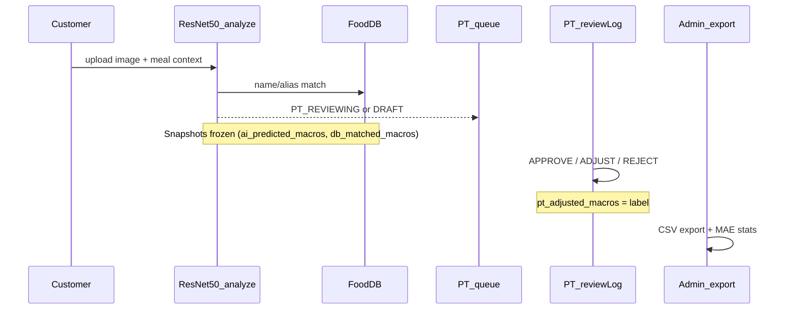

# RBL Methodology — Computer Vision Ground Truth

This document describes the Research Baseline Layer (RBL) pipeline for collecting PT-labeled ground truth from meal photos and exporting datasets for thesis analysis.

**See also:** [RESEARCH.md](./RESEARCH.md) for research questions, limitations, and overview.

## 1. Pipeline Overview



**Important:** SOS ticket resolution does **not** create ground truth. Only `reviewLog` actions label data.

## 2. Snapshot Rules (R0)

| Snapshot | Set at | Must not change after |
|----------|--------|----------------------|
| `ai_predicted_macros` | `analyzeMeal` | Never overwritten by hybrid or PT |
| `db_matched_macros` | `analyzeMeal` | Saved even when `db_applied=false` |
| `macros_at_review` | Start of `reviewLog` | Before PT mutates `macros_json` |
| `pt_adjusted_macros` | APPROVE or ADJUST | Final label |
| `pt_blind_macros` | Blind estimate (R5) | PT estimate before seeing AI/DB |

## 3. MAE Definition

```
MAE_calories = mean(|ai_predicted_macros.calories - pt_adjusted_macros.calories|)
```

- **Baseline:** `ai_predicted_macros` (never `macros_json`, which may reflect hybrid output)
- **Label:** `pt_adjusted_macros`
- **Included:** APPROVE + ADJUST_MACROS only
- **Excluded:** REJECT (negative samples), MANUAL logs when `cvOnly=true`, legacy logs without snapshots

## 4. Hybrid CV → Food DB Matching

After ResNet50 returns `food_code` / `foodName`, `FoodCatalogServiceImpl` matches against the `food_items` catalog (via `ResNetFoodCodeMapping` for the 10 trained dishes).

### 4.1 Normalization

```
normalize(text):
  NFD unicode → strip diacritics → lowercase → trim
```

Example: `"Phở Bò"` → `"pho bo"`

### 4.2 Match scoring

For each `food_items` row, score against normalized query name (`foodName` or mapped `food_code` display name):

| Match target | Score if `contains(query)` |
|--------------|--------------------------|
| `name_vi` | +10 |
| `name_en` | +8 |
| Each entry in `aliases` (JSONB) | +6 |

- `findMatches(foodName, limit)` — sort by score descending, return top N
- `findBestMatch` — top-1 result
- `getMatchScore(foodName, foodItemId)` — score for a specific item

### 4.3 When hybrid is applied (`DietLogServiceImpl`)

| Condition | `recognitionSource` | `macros_json` shown to user |
|-----------|---------------------|----------------------------|
| HOTPOT + user selected items | `HYBRID` | Sum from DB items |
| COMPOSITE + user selected items | `HYBRID` | Sum from DB items |
| Best DB match + VLM confidence ≥ 0.6 | `HYBRID` | DB macros scaled by VLM portion |
| Best DB match + confidence < 0.6 | `AI_ONLY` | VLM macros (DB snapshot still saved) |
| No DB match | `AI_ONLY` | VLM macros |

`db_matched_macros` and `db_match_score` are **always saved** when a match exists, even if hybrid is not applied (`db_applied=false` in `ai_raw_json`).

### 4.4 Portion scaling (simple match)

When hybrid applies for a simple meal:
```
portion = VLM portionSize ?? food.serving_size_g
macros = food.macros * (portion / serving_size_g)
```

## 5. Experiment Cohorts

Persisted at analyze time via `RblCohortUtil`:

| Cohort | Condition |
|--------|-----------|
| `MANUAL_ENTRY` | `recognitionSource = MANUAL` |
| `HOTPOT_HYBRID` | `mealComplexity = HOTPOT` |
| `COMPOSITE_BUFFET` | `mealComplexity = COMPOSITE` |
| `RESTAURANT_AI_ONLY` | Eating out + `recognitionSource = AI_ONLY` |
| `RESTAURANT_HYBRID_DB` | Eating out + `recognitionSource = HYBRID` |
| `HOME_HYBRID_DB` | `HOME_COOKED` + `recognitionSource = HYBRID` |
| `AI_ONLY_BASELINE` | `recognitionSource = AI_ONLY`, home/simple |
| `OTHER` | Fallback |

## 6. CSV Export Schema

**Endpoint:** `GET /api/v1/admin/rbl/export`

First line is a metadata comment:
```
# food_db_version=v2-60
```

### 6.1 Column reference

| Column | Type | Description |
|--------|------|-------------|
| `log_id` | UUID | Diet log identifier |
| `log_date` | date | Log date |
| `meal_source` | enum | HOME_COOKED, RESTAURANT, TAKEOUT, CANTEEN |
| `meal_complexity` | enum | SIMPLE, HOTPOT, COMPOSITE |
| `recognition_source` | enum | AI_ONLY, DB_MATCH, HYBRID, MANUAL, PT_ADJUSTED |
| `experiment_cohort` | enum | See §5 |
| `ai_confidence` | decimal | VLM confidence (0–1) |
| `db_match_score` | int | Food DB match score (§4.2) |
| `model_version` | string | e.g. `resnet50-vtn-10class` |
| `prompt_version` | string | SHA hash of system prompt |
| `ai_food_name` | string | VLM-detected food name |
| `db_food_name` | string | Matched `food_items.name_vi` |
| `ai_cal`, `ai_pro`, `ai_carb`, `ai_fat` | decimal | Frozen `ai_predicted_macros` |
| `db_cal`, `db_pro`, `db_carb`, `db_fat` | decimal | Frozen `db_matched_macros` |
| `pt_cal`, `pt_pro`, `pt_carb`, `pt_fat` | decimal | Ground truth `pt_adjusted_macros` |
| `delta_ai_cal` | decimal | \|ai_cal − pt_cal\| |
| `delta_db_cal` | decimal | \|db_cal − pt_cal\| |
| `pt_action` | enum | APPROVE, ADJUST_MACROS, REJECT |
| `pt_correction_reason` | enum | WRONG_FOOD, WRONG_PORTION, etc. |
| `pt_reviewed_at` | datetime | Review timestamp |
| `sos_ticket_flag` | boolean | Linked SOS ticket exists |
| `sos_reason_code` | enum | SOS reason if any |
| `fields_changed` | string | Comma-separated macro fields PT changed |
| `customer_id_hash` | string | SHA-256 anonymized customer ID |
| `image_object_name` | string | MinIO object key (stable image reference) |
| `ai_portion_g` | decimal | VLM portion from `ai_raw_json.portionSize` |
| `db_applied` | boolean | Whether hybrid macros were applied to client view |
| `blind_cal`, `blind_pro`, `blind_carb`, `blind_fat` | decimal | PT blind estimate (R5) |
| `diet_log_items_json` | JSON string | Hotpot/composite line items |

## 7. Export Filters (`RblDatasetFilter`)

Default admin export uses:

- `cvOnly=true` — excludes `recognitionSource=MANUAL`
- `includeRejected=false` — MAE-focused positive labels only
- Date range optional (`from`, `to`)
- Optional: `mealSource`, `recognitionSource`

## 8. Blind Review (R5)

Optional PT workflow to reduce label leakage:

1. PT toggles blind mode on a pending log (`/pt/reviews`)
2. PT enters macro estimate → `PUT /workspace/diet-logs/{id}/blind-estimate`
3. UI reveals AI/DB columns
4. PT completes normal APPROVE/ADJUST/REJECT

Stats API includes `blindVsAiMae` / `blindVsPtMae` when blind estimates exist.

## 9. Python Analysis Workflow

```python
import pandas as pd

# Skip metadata comment line
df = pd.read_csv("rbl_export.csv", comment="#")
labeled = df[df["pt_action"].isin(["APPROVE", "ADJUST_MACROS"])]

mae_kcal = (labeled["ai_cal"] - labeled["pt_cal"]).abs().mean()
print(f"MAE AI calories: {mae_kcal:.1f}")

# By cohort
print(labeled.groupby("experiment_cohort").apply(
    lambda g: (g["ai_cal"] - g["pt_cal"]).abs().mean()
))

# Hybrid vs AI-only
for src in ["AI_ONLY", "HYBRID"]:
    sub = labeled[labeled["recognition_source"] == src]
    if len(sub) > 0:
        print(f"{src} MAE: {(sub['ai_cal'] - sub['pt_cal']).abs().mean():.1f} (n={len(sub)})")
```

## 10. Hypothesis Table (thesis template)

| Hypothesis | Metric | Expected direction |
|------------|--------|-------------------|
| H1: Restaurant meals harder than home-cooked | `adjustRateByMealSource.RESTAURANT` > HOME | Higher adjust rate |
| H2: Hybrid reduces AI error when DB match strong | `maeByDbMatchScoreBucket.high` < low | Lower MAE in high bucket |
| H3: Low confidence correlates with higher error | `calibrationBuckets` slope | Positive correlation |
| H4: Composite/buffet highest complexity | `compositeMealCount`, cohort MAE | Highest MAE |
| H5: Blind PT closer to ground truth than AI | `blindVsPtMae` < `maeAiCalories` | Blind reduces error |

## 11. Sample Size Guidance

- `insufficientSample=true` when labeled CV count < 30
- Collect ≥30 reviewed CV logs before writing Results section
- `legacyLogsExcluded` counts pre-R0 logs without snapshots

## 12. API Quick Reference

| Endpoint | Role |
|----------|------|
| `GET /admin/rbl/export` | Download CSV |
| `GET /admin/rbl/export/preview` | Preview count + sample rows |
| `GET /admin/rbl/stats` | Dashboard metrics |
| `GET /admin/rbl/report` | Markdown report |
| `GET /workspace/rbl/stats` | PT-scoped RBL stats |
| `PUT /workspace/diet-logs/{id}/blind-estimate` | Blind macro entry |

---

*Document Version: 2.0.0*
*Last Updated: 2026-06-20*
