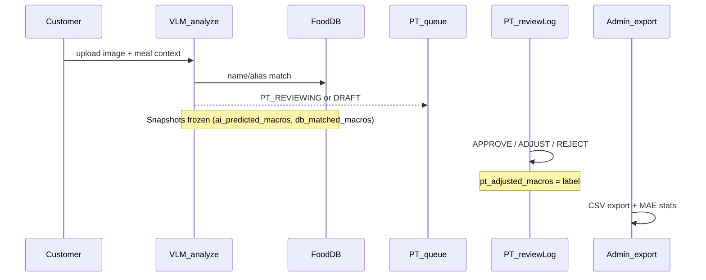

# RBL Methodology — Computer Vision Ground Truth

This document describes the Research Baseline Layer (RBL) pipeline for collecting PT-labeled ground truth from meal photos and exporting datasets for thesis analysis.

## 1. Pipeline Overview



**Important:** SOS ticket resolution does **not** create ground truth. Only `reviewLog` actions label data.

## 2. Snapshot Rules (R0)

| Snapshot | Set at | Must not change after |
|----------|--------|----------------------|
| `ai_predicted_macros` | `analyzeMeal` | Never overwritten by hybrid or PT |
| `db_matched_macros` | `analyzeMeal` | Saved even when `db_applied=false` |
| `macros_at_review` | Start of `reviewLog` | Before PT mutates `macros_json` |
| `pt_adjusted_macros` | APPROVE or ADJUST | Final label |

## 3. MAE Definition

```
MAE_calories = mean(|ai_predicted_macros.calories - pt_adjusted_macros.calories|)
```

- **Baseline:** `ai_predicted_macros` (never `macros_json`, which may reflect hybrid output)
- **Label:** `pt_adjusted_macros`
- **Included:** APPROVE + ADJUST_MACROS only
- **Excluded:** REJECT (negative samples), MANUAL logs when `cvOnly=true`, legacy logs without snapshots

## 4. Experiment Cohorts

Persisted at analyze time via `RblCohortUtil`:

| Cohort | Condition |
|--------|-----------|
| `HOME_SIMPLE` | HOME_COOKED + SIMPLE |
| `RESTAURANT_SIMPLE` | RESTAURANT + SIMPLE + AI_ONLY |
| `RESTAURANT_HYBRID` | RESTAURANT + HYBRID applied |
| `HOTPOT` | mealComplexity = HOTPOT |
| `COMPOSITE_BUFFET` | mealComplexity = COMPOSITE |

## 5. Export Filters (`RblDatasetFilter`)

Default admin export uses:

- `cvOnly=true` — excludes `recognitionSource=MANUAL`
- `includeRejected=false` — MAE-focused positive labels only
- Date range optional (`from`, `to`)

CSV includes anonymized `customer_hash` (SHA-256 of customer ID + salt), stable `image_object_name`, and `diet_log_items_json` for hotpot/composite meals.

## 6. Blind Review (R5)

Optional PT workflow to reduce label leakage:

1. PT toggles blind mode on a pending log
2. PT enters macro estimate → `PUT /workspace/diet-logs/{id}/blind-estimate`
3. UI reveals AI/DB columns
4. PT completes normal APPROVE/ADJUST/REJECT

Export includes `pt_blind_macros` for `blindVsAiMae` / `blindVsPtMae` stats.

## 7. Python Analysis Workflow

```python
import pandas as pd

df = pd.read_csv("rbl_export.csv")
labeled = df[df["pt_action"].isin(["APPROVE", "ADJUST_MACROS"])]

mae_kcal = (labeled["ai_calories"] - labeled["pt_calories"]).abs().mean()
print(f"MAE AI calories: {mae_kcal:.1f}")

# By cohort
print(labeled.groupby("experiment_cohort").apply(
    lambda g: (g["ai_calories"] - g["pt_calories"]).abs().mean()
))
```

## 8. Hypothesis Table (thesis template)

| Hypothesis | Metric | Expected direction |
|------------|--------|-------------------|
| H1: Restaurant meals harder than home-cooked | `adjustRateByMealSource.RESTAURANT` > HOME | Higher adjust rate |
| H2: Hybrid reduces AI error when DB match strong | `maeByDbMatchScoreBucket.high` < low | Lower MAE in high bucket |
| H3: Low confidence correlates with higher error | `calibrationBuckets` slope | Positive correlation |
| H4: Composite/buffet highest complexity | `compositeMealCount`, cohort MAE | Highest MAE |
| H5: Blind PT closer to ground truth than AI | `blindVsPtMae` < `maeAiCalories` | Blind reduces error |

## 9. Sample Size Guidance

- `insufficientSample=true` when labeled CV count < 30
- Collect ≥30 reviewed CV logs before writing Results section
- `legacyLogsExcluded` counts pre-R0 logs without snapshots

## 10. API Quick Reference

| Endpoint | Role |
|----------|------|
| `GET /admin/rbl/export` | Download CSV |
| `GET /admin/rbl/export/preview` | Preview count |
| `GET /admin/rbl/stats` | Dashboard metrics |
| `GET /admin/rbl/report` | Markdown report |
| `PUT /workspace/diet-logs/{id}/blind-estimate` | Blind macro entry |
