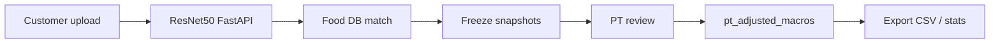

# NutriCan — Computer Vision Research Overview (ResNet50)

Tài liệu tổng quan cho hướng nghiên cứu **ResNet50 + Research Baseline Layer (RBL)**. Đọc trước khi viết luận văn / báo cáo.

**Tài liệu liên quan:**
- [BIEN_BAN_AI_MODULE.md](./research/BIEN_BAN_AI_MODULE.md) — mapping biên bản bàn giao
- [RBL_METHODOLOGY.md](./RBL_METHODOLOGY.md) — pipeline ground truth, MAE, export CSV
- [KE_HOACH.md](./research/KE_HOACH.md) — RQ/H1–H4

---

## 1. Vấn đề nghiên cứu

Ước lượng dinh dưỡng từ ảnh món ăn Việt Nam khó vì:
- Đa dạng món, presentation khác nhau
- CNN chỉ cover **10 món** trong MVP (Biên bản bàn giao)
- Macro trực tiếp từ bảng giả lập chưa thay thế VTN_FCT đầy đủ

NutriCan giải quyết bằng:
1. **ResNet50** (`best_resnet50_model.h5`) nhận diện 10 class + macro giả lập (A1.0)
2. **Hybrid CV→DB:** map `food_code` → `food_items` (526 VTN + 10 ResNet dishes)
3. **PT** làm ground truth qua RBL
4. Snapshot bất biến để đo lỗi và viết kết quả

---

## 2. Ánh xạ A1.0 / A1.1 / ΔA

| Khái niệm | NutriCan | CSV field |
|-----------|----------|-----------|
| **A1.0** | CNN + `MACRO_DATABASE` (FastAPI) | `ai_cal/pro/carb/fat` |
| **A1.1** | `food_code` → Food DB | `db_cal/pro/carb/fat` |
| Ground truth | PT APPROVE/ADJUST | `pt_cal/pro/carb/fat` |
| **ΔA** | Giảm sai số nhờ grounding | `mean(delta_ai_cal) − mean(delta_db_cal)` |

---

## 3. Research Questions

| ID | Câu hỏi | Metric |
|----|---------|--------|
| RQ1 | ResNet50 Top-1 trên 10 món Việt? | Accuracy, F1, confusion matrix |
| RQ2 | Confidence 25–40% có calibrated? | Bucket accuracy |
| RQ3 | Macro A1.0 sai bao nhiêu vs PT? | MAE cal/P/C/F |
| RQ4 | Grounding `food_code` giảm sai số? | ΔA |

---

## 4. Phạm vi Computer Vision

| Có | Không |
|----|-------|
| Phân loại 10 món Việt (ResNet50) | VLM/Ollama cho meal recognition |
| Macro giả lập + hybrid DB | Portion estimation từ ảnh |
| Offline eval trên Vietnamese_Food_Dataset | Train model mới trong scope thesis |
| RBL + PT label | Generalize toàn bộ ẩm thực VN |

### 4.1 Mô hình

| Thành phần | Giá trị |
|-----------|---------|
| Model file | `best_resnet50_model.h5` |
| `modelVersion` | `resnet50-vtn-10class` |
| FastAPI | `:8000/api/v1/analyze-food` |
| Input | RGB 224×224, `resnet50.preprocess_input` |
| Confidence threshold | **0.25** (`ai.resnet.confidence-threshold`) |
| Default portion | 100g (limitation) |

Chatbot vẫn có thể dùng Ollama — **không** dùng cho `analyzeMeal`.

### 4.2 Hybrid CV → Food DB

```
ResNet food_code → ResNetFoodCodeMapping.nameVi
                → FoodCatalogService.findBestMatch
                → db_matched_macros (snapshot)
                → nếu confidence ≥ 0.25 + match: HYBRID
```

Chi tiết: [RBL_METHODOLOGY.md §4](./RBL_METHODOLOGY.md).

---

## 5. RBL Pipeline



---

## 6. Workflow thu thập

### Chuẩn bị
```powershell
# AI service (Python 3.10–3.12 + TensorFlow)
$env:MODEL_PATH = "d:\FPT\SU26\SBA\project_team\research\best_resnet50_model.h5"
.\research\scripts\start_ai_service.ps1

# Backend
cd nutrican-be && docker-compose up -d
./mvnw spring-boot:run
```

### Seed RBL cohort ResNet10
```bash
python research/scripts/prepare_resnet_rbl_seed.py   # 30 in-class + 3 negative
python research/scripts/seed_resnet_rbl.py           # upload + PT label (backend up)
```

### Offline eval
```bash
python research/scripts/eval_resnet50.py
python research/scripts/resnet50_calibration.py
python research/scripts/rbl_analyze.py research/output/rbl_export.csv
```

---

## 7. Limitations

| Hạn chế | Ảnh hưởng |
|---------|-----------|
| Chỉ 10 class | Ảnh ngoài scope → fallback / WRONG_FOOD |
| Macro giả lập | MAE A1.0 cao vs PT thật |
| Confidence thấp (25–40%) | Nhiều DRAFT nếu threshold cao |
| Không estimate portion | Default 100g |
| TF cần Python ≤3.12 | Dev env phải pin version |

---

## 8. Reproducibility

- [ ] `model_version` = `resnet50-vtn-10class`
- [ ] `prompt_version` = hash class list
- [ ] Eval seed = 42, split 80/20 stratified
- [ ] `food_db_version` trong CSV header
- [ ] Commit hash / ngày thu thập

---

*Document Version: 2.0.0 (ResNet50) | Last Updated: 2026-06-17*
