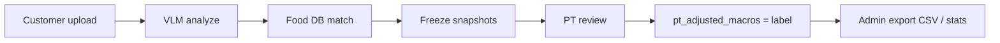

# NutriCan — Computer Vision Research Overview

Tai lieu tong quan cho huong nghien cuu **Computer Vision (CV) + Research Baseline Layer (RBL)** cua du an NutriCan PT. Doc file nay truoc khi viet luan van / bao cao nghien cuu.

**Tai lieu lien quan:**
- [RBL_METHODOLOGY.md](./RBL_METHODOLOGY.md) — pipeline thu thap ground truth, MAE, export CSV
- [FEATURES.md](./FEATURES.md) §3.12 — RBL trong san pham
- [API_DOCUMENTATION.md](./API_DOCUMENTATION.md) §6.8–6.11 — RBL API
- [DATABASE_SCHEMA.md](./DATABASE_SCHEMA.md) — field RBL tren `diet_logs`

---

## 1. Van de nghien cuu

Uoc luong dinh duong tu anh mon an la bai toan CV thuc te nhung kho do:
- Mon an Viet Nam da dang (com, pho, lau, buffet)
- Anh chup ngoai hang thieu thong tin portion
- VLM (Vision-Language Model) tra ve macros nhung khong co nhan chuan chinh xac

NutriCan giai quyet bang cach:
1. Dung **VLM** (`qwen2.5-vl` qua Ollama) de nhan dien mon + uoc luong macro tu anh
2. Ket hop **Food DB** (catalog mon Viet) khi match du tot (hybrid CV→DB)
3. Dung **PT (Personal Trainer)** lam nguon **ground truth** qua workflow review co kiem soat
4. Luu snapshot bat bien (RBL) de do loi va viet ket qua nghien cuu

---

## 2. Anh xa A1.0 / A1.1 / ΔA (Improve 2.2)

| Khai niem | NutriCan | CSV field |
|-----------|----------|-----------|
| **A1.0** baseline (VLM truc tiep) | `ai_predicted_macros` | `ai_cal/pro/carb/fat` |
| **A1.1** cai tien (grounding DB) | `db_matched_macros` | `db_cal/pro/carb/fat` |
| Ground truth | PT APPROVE/ADJUST | `pt_cal/pro/carb/fat` |
| **ΔA** | Giam sai so nho grounding | `mean(delta_ai_cal) − mean(delta_db_cal)` |

Chi tiet: [research/KE_HOACH.md](./research/KE_HOACH.md) §2.

---

## 3. Cau hoi nghien cuu (Research Questions)

| ID | Cau hoi | Metric chinh |
|----|---------|--------------|
| RQ1 | VLM uoc luong calories sai bao nhieu so voi nhan PT? | `maeAiCalories` |
| RQ2 | Mon an ngoai hang co kho hon mon tu nau khong? | `adjustRateByMealSource`, MAE theo `meal_source` |
| RQ3 | Hybrid CV→DB co giam sai so khi match score cao khong? | `maeByDbMatchScoreBucket` |
| RQ4 | Confidence score cua VLM co tuong quan voi do sai khong? | `calibrationBuckets` |
| RQ5 | Mon phuc tap (lau, buffet) co MAE cao hon mon don gian khong? | MAE theo `experiment_cohort` |
| RQ6 | PT blind estimate co gan ground truth hon AI khong? | `blindVsAiMae` vs `blindVsPtMae` |

Bang gia thuyet chi tiet: [RBL_METHODOLOGY.md §8](./RBL_METHODOLOGY.md#8-hypothesis-table-thesis-template).

---

## 4. Pham vi Computer Vision

### 3.1 Du an lam gi

| Co | Khong |
|----|-------|
| Nhan dien ten mon tu anh (VLM) | Object detection bounding box (YOLO, etc.) |
| Uoc luong portion + macros (cal, P/C/F) | Phan loai pixel-level segmentation |
| Hybrid: map ten VLM → Food DB | Training custom CNN tu dau |
| Thu thap dataset anh + nhan PT | Crawl anh tu internet |

### 3.2 Mo hinh su dung

| Thanh phan | Gia tri | Ghi chu |
|-----------|---------|---------|
| Model | `qwen2.5-vl` (config: `ai.ollama.default-model`) | Vision-Language Model |
| Runtime | Ollama local | `http://localhost:11434` |
| Input | JPEG/PNG, max 500KB | Luu MinIO |
| Temperature | 0.1 | Giam bien dong output |
| Confidence threshold | 0.6 | `< 0.6` → status `DRAFT` |
| Reproducibility | `model_version`, `prompt_version` (SHA hash prompt) | Luu tren moi `diet_log` |

Prompt hien tai: [FEATURES.md §2.4](./FEATURES.md#24-ai-prompt) hoac `MealRecognitionServiceImpl.SYSTEM_PROMPT`.

### 3.3 Hybrid CV → Food DB

Sau khi VLM tra `foodName`, he thong tim mon trong `food_items`:

```
VLM foodName → normalize (bo dau, lowercase)
            → score match (name_vi +10, name_en +8, alias +6)
            → best match → db_matched_macros (luon luu snapshot)
            → neu confidence >= 0.6: ap dung hybrid → macros_json = DB
```

Chi tiet thuat toan: [RBL_METHODOLOGY.md §4](./RBL_METHODOLOGY.md#4-hybrid-cv--food-db-matching).

---

## 5. Research Baseline Layer (RBL)

RBL la lop nghien cuu **bat bien** — dong bang prediction tai thoi diem `analyzeMeal` de PT review tao nhan do duoc.



**Quy tac quan trong:**
- MAE baseline = `ai_predicted_macros` vs `pt_adjusted_macros` (khong dung `macros_json` sau hybrid)
- Chi `APPROVE` + `ADJUST_MACROS` vao MAE; `REJECT` = negative sample
- SOS resolution **khong** tao ground truth

Pipeline day du: [RBL_METHODOLOGY.md](./RBL_METHODOLOGY.md).

---

## 6. Experiment Cohorts

Gan tai `analyzeMeal` qua `RblCohortUtil`:

| Cohort | Dieu kien |
|--------|-----------|
| `MANUAL_ENTRY` | `recognitionSource = MANUAL` |
| `HOTPOT_HYBRID` | `mealComplexity = HOTPOT` |
| `COMPOSITE_BUFFET` | `mealComplexity = COMPOSITE` |
| `RESTAURANT_AI_ONLY` | An ngoai + `AI_ONLY` |
| `RESTAURANT_HYBRID_DB` | An ngoai + `HYBRID` |
| `HOME_HYBRID_DB` | Tu nau + `HYBRID` |
| `AI_ONLY_BASELINE` | VLM thuan, khong ap dung DB |
| `OTHER` | Truong hop con lai |

---

## 7. Metrics & Evaluation

### 6.1 Primary metrics

```
MAE_calories = mean(|ai_predicted_macros.calories - pt_adjusted_macros.calories|)
```

Tuong tu cho protein, carb, fat (tinh trong Python tu CSV export).

### 6.2 Secondary metrics

| Metric | Mo ta |
|--------|-------|
| `adjustRate` | Ty le PT chon ADJUST_MACROS |
| `adjustRateByMealSource` | Adjust rate theo HOME vs RESTAURANT |
| `maeByDbMatchScoreBucket` | MAE theo bucket match score (low/mid/high) |
| `calibrationBuckets` | MAE theo khoang `ai_confidence` |
| `blindVsAiMae` | PT blind estimate vs AI |
| `blindVsPtMae` | PT blind estimate vs ground truth |
| `legacyLogsExcluded` | Log cu khong co snapshot R0 |

### 6.3 Sample size

- `insufficientSample = true` khi labeled CV count < 30
- Can **≥ 30** log CV da review truoc khi viet phan Results

---

## 8. Dataset Export

Admin tai dataset qua:
- `GET /api/v1/admin/rbl/export` — CSV
- `GET /api/v1/admin/rbl/stats` — metrics dashboard
- `GET /api/v1/admin/rbl/report` — Markdown report

Filter mac dinh: `cvOnly=true`, `includeRejected=false`.

Schema CSV day du: [RBL_METHODOLOGY.md §6](./RBL_METHODOLOGY.md#6-csv-export-schema).

**Privacy:** `customer_id_hash` = SHA-256(customer_id + salt), khong export ten/email.

---

## 9. Workflow thu thap du lieu

### Buoc 1 — Chuan bi moi truong
```bash
cd nutrican-be && docker-compose up -d
ollama pull qwen2.5-vl && ollama serve
./mvnw spring-boot:run
cd ../nutrican-fe && npm run dev
```

### Buoc 2 — Thu thap log CV
1. Customer upload anh mon (chon dung `mealSource`, `mealComplexity`)
2. He thong analyze → status `PT_REVIEWING` hoac `DRAFT`
3. Customer submit DRAFT neu can: `PUT /diet/logs/{id}/submit-for-review`

### Buoc 3 — PT labeling
1. PT vao `/pt/reviews`
2. (Tuy chon) Bat **Blind mode** → nhap macro → reveal AI/DB
3. APPROVE / ADJUST_MACROS / REJECT + `correctionReason`

### Buoc 4 — Export & phan tich
1. Admin vao `/admin` → section RBL Research
2. Download CSV + Report
3. Phan tich Python (mau trong RBL_METHODOLOGY §7)

Chi tiet dev workflow: [DEVELOPMENT.md §11](./DEVELOPMENT.md#11-research-data-collection-workflow).

---

## 10. Limitations (Han che)

| Han che | Anh huong |
|---------|-----------|
| Ground truth = y kien PT | Co the co bias chuyen mon / ca nhan |
| VLM local (Ollama) | Phu thuoc phan cung, khong cloud-scale |
| Anh max 500KB | Mat chi tiet portion |
| Food DB ~60 mon (v2) | Match yeu voi mon ngoai catalog |
| Khong train/fine-tune VLM | Chi danh gia zero-shot/few-shot prompt |
| Confidence tu VLM tu bao cao | Calibration can verify bang data |
| Mau nho (<30) | Ket qua thong ke chua on dinh |

---

## 11. Ethics & Privacy

- Anh mon an luu MinIO, chi admin export `image_object_name` (khong URL public trong CSV)
- PII anonymize: hash customer ID, khong export ho ten/email
- PT review la nhan nghe nghiep — can thong bao participant trong luan van
- Dataset chi dung cho muc dich hoc tap / nghien cuu noi bo du an

---

## 12. Related Work (tham khao)

| Huong | Vi du | Khac biet voi NutriCan |
|-------|-------|------------------------|
| App calorie tracking | MyFitnessPal, FatSecret | Nhap tay, khong CV |
| CV food recognition | Foodvisor, Calorie Mama | Commercial, khong co PT ground truth pipeline |
| VLM nutrition | GPT-4V, Qwen-VL papers | NutriCan do MAE co he thong + cohort |
| Dataset | Nutrition5k, Food-101 | NutriCan tu build dataset thuc te qua PT review |

---

## 13. Reproducibility Checklist

Truoc khi bao cao ket qua, ghi ro:

- [ ] `model_version` (ten model Ollama)
- [ ] `prompt_version` (hash prompt — doi prompt = doi version)
- [ ] `food_db_version` (header CSV, hien tai `v2-60`)
- [ ] Khoang thoi gian thu thap (`from`, `to`)
- [ ] So mau labeled CV (≥ 30?)
- [ ] Filter export (`cvOnly`, `includeRejected`)
- [ ] Phien ban code / commit hash

---

## 14. UI lien quan nghien cuu

| Route | Vai tro | Chuc nang RBL |
|-------|---------|---------------|
| `/diet` | Customer | Upload anh + meal context |
| `/pt/reviews` | PT | Review, blind mode, RBL stats |
| `/admin` | Admin | RBL dashboard, export CSV/report |

Chi tiet UI: [FRONTEND.md §12](./FRONTEND.md#12-research--rbl-ui).

---

*Document Version: 1.0.0*
*Last Updated: 2026-06-20*
