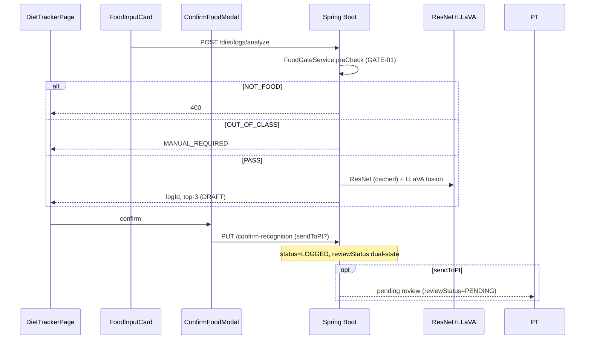

# NutriCan — Tổng hợp dự án FE + BE (Workflow & Logic nghiệp vụ)

> **Vai trò:** Tài liệu kỹ thuật triển khai — đồng bộ Master Spec v3 + Addendum v3.1.  
> **Cập nhật:** 2026-07-07 · **v3 + v3.1** gate green (120 BE · 58 E2E · 34 layers)  
> **Spec:** [NUTRICAN_PT_MASTER_SPEC_v3.md](./NUTRICAN_PT_MASTER_SPEC_v3.md) · Addendum: [NUTRICAN_PT_GAP_ADDENDUM_v3_1.md](./NUTRICAN_PT_GAP_ADDENDUM_v3_1.md) · v2: [NUTRICAN_PT_MASTER_SPEC_v2.md](./NUTRICAN_PT_MASTER_SPEC_v2.md)

**PRD chứa:** BR, FR, AC, Constraints đầy đủ · **File này chứa:** code map, workflow chi tiết, logic module, chạy local.

---

## Mục lục

1. [Inventory file mới (merge main)](#1-inventory-file-mới-merge-main)
2. [Tổng quan & stack](#2-tổng-quan--stack)
3. [Kiến trúc & luồng chính](#3-kiến-trúc--luồng-chính)
4. [Vai trò & RBAC](#4-vai-trò--rbac)
5. [Cấu trúc mã nguồn](#5-cấu-trúc-mã-nguồn)
6. [Logic nghiệp vụ theo module](#6-logic-nghiệp-vụ-theo-module)
7. [Business Rules (tóm tắt — khớp PRD §7)](#7-business-rules-tóm-tắt--khớp-prd-7)
8. [Constraints (khớp PRD §8)](#8-constraints-khớp-prd-8)
9. [Workflows end-to-end](#9-workflows-end-to-end)
10. [Luồng chi tiết từng feature](#10-luồng-chi-tiết-từng-feature)
11. [Pipeline AI](#11-pipeline-ai)
12. [Dữ liệu & entity](#12-dữ-liệu--entity)
13. [Bản đồ API](#13-bản-đồ-api)
14. [Frontend — routing, components, services](#14-frontend--routing-components-services)
15. [Cấu hình & chạy local](#15-cấu-hình--chạy-local)
16. [RBL research](#16-rbl-research)
17. [Gap & gợi ý làm lại](#17-gap--gợi-ý-làm-lại)
18. [Tài liệu liên quan](#18-tài-liệu-liên-quan)

---

## 1. Inventory file mới (merge main)

> Khớp PRD — Inventory. Commit chính: `197619e1`, `aa493c00`, merge `f76a9f25`.

### 1.1 Backend — 6 file Java mới

| File | Vai trò |
|------|---------|
| `common/entity/SystemSetting.java` | Key-value config (PK = `key`) |
| `common/repository/SystemSettingRepository.java` | JPA repo |
| `user/controller/SystemSettingController.java` | `GET /settings/require-kyc`, `PUT /admin/settings/require-kyc` |
| `user/dto/CertificationData.java` | JSONB chứng chỉ trên `PtProfile` |
| `user/dto/CertificationRequest.java` | DTO đăng ký PT + validation |
| `user/enums/TrainingMode.java` | `ONLINE` \| `OFFLINE` \| `BOTH` |

### 1.2 Backend — sửa đáng kể

| File | Thay đổi |
|------|----------|
| `user/entity/PtProfile.java` | `experienceStartDate`, `contactPhone`, `trainingMode`, `location`, `rateUnit`, `certifications` JSONB, social, `getYearsOfExperience()` |
| `user/dto/PtRegistrationRequest.java` | Form đầy đủ + Jakarta validation |
| `user/service/impl/UserProfileServiceImpl.java` | KYC gate, CERTIFIED cần cert, `uploadCertImage` → `pt-certs/` |
| `admin/service/impl/PtAdminServiceImpl.java` | REJECT **không** suspend `User` |
| `admin/dto/PendingPtDto.java` | Admin xem full pending profile |
| `admin/config/DataInitializer.java` | Seed `REQUIRE_KYC_FOR_PT=false` (dev) |

### 1.3 Frontend — file mới

| File | Vai trò |
|------|---------|
| `pages/customer/components/ConfirmFoodModal.jsx` | Modal xác nhận món + gram |
| `pages/customer/components/FoodInputCard.jsx` | Tab AI / nhập thủ công |
| `pages/customer/components/MealSection.jsx` | Log theo buổi ăn |
| `pages/customer/components/NutritionProgress.jsx` | Macro vs target |
| `pages/customer/components/dietUtils.js` | Helpers macro, labels, URLs |
| `components/common/ImageLightbox.jsx` | Zoom/rotate/download ảnh |
| `assets/nutrican_*.png` (5 file) | Logo, hero, AI illustration, salad, PT badge |

### 1.4 v3 audit QA — file chính (2026-07-06)

**Backend**

| File | Vai trò |
|------|---------|
| `diet/service/impl/IntakeControlLoopServiceImpl.java` | Control loop OVER/UNDER/AT_RISK, PT alert debounce 24h |
| `diet/service/impl/DietPrefCheckServiceImpl.java` | Diet pref warn (search, plan, recipe, log) |
| `diet/service/impl/UserRecipeServiceImpl.java` | Recipe CRUD + macro từ ingredients |
| `diet/service/impl/DietLogFeedbackServiceImpl.java` | Post-meal rating + 3× low-energy PT alert |
| `user/service/impl/ProgressTimelineServiceImpl.java` | Regression, projection, milestones enrich |
| `diet/entity/IntakeDayStatus.java` | Persist intake status theo ngày |
| `diet/entity/UserRecipe*.java`, `DietLogFeedback.java` | Recipe + feedback entities |
| `user/entity/User.notificationOptIn` | JSONB NFR-14 (`postMealRating`) |
| `admin/service/impl/RblAdminServiceImpl.java` | `maeByCohortKey`, export filter cohort |
| `diet/controller/RecipeController.java` | POST/GET/PUT `/diet/recipes` |
| `diet/controller/MealPlanController.java` | suggest/skip + `GET /meal-plans/weekly-summaries` |

**Frontend**

| File | Vai trò |
|------|---------|
| `pages/customer/components/MealPlanSkipModal.jsx` | Skip meal plan với enum lý do |
| `pages/customer/components/PostMealRatingSheet.jsx` | Sheet đánh giá sau bữa |
| `pages/customer/components/ProgressTimelineCard.jsx` | Goals + milestones + regression |
| `pages/customer/ProfilePage.jsx` | Weekly summary panel, opt-out toggle, skip modal |
| `pages/pt/PtMealPlanPage.jsx` | Lưới tuần + queue đề nghị thay món |
| `pages/pt/ClientProgressPage.jsx` | Timeline, post-meal line chart, weekly form |
| `pages/admin/AdminDashboardPage.jsx` | RBL cohort key breakdown + filter |

### 1.5 v3.1 Addendum — file chính (2026-07-07)

**Backend**

| File | Vai trò |
|------|---------|
| `user/service/impl/OnboardingServiceImpl.java` | Wizard 3 bước, skip, MacroTarget |
| `user/service/impl/BodyMetricServiceImpl.java` | POST/GET body metrics, reminder status |
| `user/controller/ProfileExtensionsController.java` | `/profile/body-metrics`, onboarding APIs |
| `user/scheduler/BodyMetricReminderScheduler.java` | Weekly weight reminder WS + notification |
| `user/service/impl/CoachingLifecycleServiceImpl.java` | END_REQUESTED → COMPLETED |
| `user/service/impl/NotificationServiceImpl.java` | Persist + email hire/SOS/refund |
| `diet/scheduler/SosSlaScheduler.java` | SLA 4h/24h breach |
| `workspace/service/impl/PtWorkspaceServiceImpl.java` | `getChatContext` — PT sidebar macro summary |
| `user/service/impl/MarketplaceServiceImpl.java` | `goalFilter`, `search`, `sort=compatibility` |
| `config/RateLimitFilter.java` | Rate limit; skip loopback / disabled in dev |

**Frontend**

| File | Vai trò |
|------|---------|
| `pages/customer/OnboardingPage.jsx` | Wizard + skip |
| `components/common/OnboardingGuard.jsx` | Redirect user mới chưa có MacroTarget |
| `pages/customer/ProfilePage.jsx` | Coaching lifecycle, notification prefs, body metric |
| `components/layouts/Header.jsx` | Bell + unread badge (`aria-label="Thông báo"`) |
| `pages/admin/SosTicketsPage.jsx` | SLA tabs, reassign |
| `pages/pt/ChatPage.jsx` | Context sidebar, PDF attach |
| `services/profileExtensionsService.js` | Body metrics + onboarding API |
| `services/notificationService.js` | Notification center |

---

## 2. Tổng quan & stack

**NutriCan PT** — theo dõi dinh dưỡng + AI + PT coaching.

| Persona | Role | FE chính |
|---------|------|----------|
| Customer | `CUSTOMER` | `/diet`, `/marketplace`, `/macro-targets`, `/chat` |
| PT | `PT_CERTIFIED` / `PT_FREELANCE` | `/pt/*` |
| Admin | `ADMIN` | `/admin/*` |

| Layer | Công nghệ |
|-------|-----------|
| FE | React 19, Vite, Tailwind, Zustand, Axios, React Router 7 |
| BE | Spring Boot 4.x, Java 17, JPA, PostgreSQL |
| Storage | MinIO: `diet-logs/`, `pt-certs/`, `pt-cvs/` |
| AI | FastAPI ResNet `:8000` (199 class) + Ollama LLaVA |
| Auth | JWT + HttpOnly refresh cookie |

**IN scope (PRD):** Auth, Diet AI+manual+confirm, Marketplace, Chat, KYC configurable, PT onboarding đầy đủ, Admin/SOS/RBL, UI rebrand.  
**OUT scope:** Mobile native, thanh toán, video call, SSE `/workspace/stream`, production DB migration.

---

## 3. Kiến trúc & luồng chính

```
┌─────────────┐     HTTPS/REST      ┌──────────────────┐
│  React FE   │ ──────────────────► │  Spring Boot BE  │
│  :5173      │ ◄────────────────── │  :8080           │
└─────────────┘   Bearer + Cookie   └────────┬─────────┘
                    ┌──────────────────────┼──────────────────┐
                    ▼                      ▼                  ▼
             PostgreSQL              MinIO              Ollama LLaVA
                    │                      │
                    └──────────► FastAPI ResNet :8000
```

**Nguyên tắc BE:** Modular monolith — package tách domain; cross-module qua service (`UserQueryService`), không query chéo repository.

**Luồng analyze meal (WF-A) — GATE-01:**

```
FoodInputCard → POST /diet/logs/analyze
  → FoodGateService.preCheck (ResNet-only, TRƯỚC LLaVA)
      NOT_FOOD → 400, không upload ảnh, không chạy pipeline
      OUT_OF_CLASS → DietLog MANUAL_REQUIRED + redirect tab nhập tay
      PASS → ResNet (cached) + LLaVA + MealAnalysisFusion + NutriHome macro
  → MinIO upload (chỉ khi PASS hoặc OUT_OF_CLASS)
  → DietLog DRAFT (nếu PASS)
  → ConfirmFoodModal → PUT /confirm-recognition → status=LOGGED
  → reviewStatus: NOT_REQUIRED | PENDING (sendToPt)
  → allergyWarnings trên response (toast FE)
  → Summary chỉ đếm LOGGED
```

---

## 4. Vai trò & RBAC

### 4.1 `UserRole`

| Role | Tier | Route |
|------|------|-------|
| `CUSTOMER` | — | `/diet`, `/marketplace`, … |
| `PT_CERTIFIED` | TIER_1 | `/pt/*` |
| `PT_FREELANCE` | TIER_2 | `/pt/*` |
| `ADMIN` | — | `/admin/*` |

PT workspace: `@PreAuthorize("hasAnyRole('PT_CERTIFIED','PT_FREELANCE')")`.

### 4.2 `UserStatus`

| Status | Ý nghĩa |
|--------|---------|
| `ACTIVE` | Login OK |
| `PENDING_PASSWORD` | Google lần đầu → `/set-password` |
| `PENDING_APPROVAL` / `PENDING_VERIFICATION` | Chặn login |
| `SUSPENDED` / `INACTIVE` | Chặn login |

### 4.3 `ClientMappingStatus`

`PENDING` → PT accept → `ACTIVE` (chat mở) · `INACTIVE`

### 4.4 RBAC (khớp PRD BR + §4.3)

| Hành động | CUSTOMER | PT | ADMIN |
|-----------|----------|-----|-------|
| Analyze meal | ✅ | ❌ | ❌ |
| Marketplace | ✅ | ❌ | ❌ |
| PT workspace | ❌ | ✅ | ❌ |
| Verify PT | ❌ | ❌ | ✅ |
| Toggle require-kyc | ❌ | ❌ | ✅ |
| RBL export | ❌ | ❌ | ✅* |

\* `RblAdminController` thiếu `@PreAuthorize(ADMIN)`.

---

## 5. Cấu trúc mã nguồn

### 5.1 Backend packages

| Package | Trách nhiệm | File chính |
|---------|-------------|------------|
| `auth` | JWT, login, Google | `AuthController`, `AuthServiceImpl`, `JwtUtil` |
| `user` | Profile, PT register, settings | `UserProfileController`, `SystemSettingController` |
| `diet` | Logs, analyze, SOS | `DietLogController`, `MealAnalysisServiceImpl` |
| `ai` | ResNet, LLaVA, fusion | `MealRecognitionServiceImpl`, `MealAnalysisFusion` |
| `workspace` | PT client, review | `PtWorkspaceController` |
| `chat` | PT–client messaging | `ChatController` |
| `kyc` | VNPT eKYC | `KycController` |
| `admin` | Dashboard, verify PT, RBL | `*AdminController` |
| `common` | `SystemSetting`, enums, DTOs | — |
| `config` | Security, CORS | `SecurityConfig` |
| `infrastructure` | MinIO, Redis, mail | `StorageService` |

### 5.2 Frontend

| Path | Nội dung |
|------|----------|
| `pages/customer/` | `DietTrackerPage` + `components/*`, `KycPage`, Marketplace, Chat |
| `pages/customer/components/` | `ConfirmFoodModal`, `FoodInputCard`, `MealSection`, `NutritionProgress`, `dietUtils.js` |
| `pages/pt/` | Dashboard, Clients, Review, Chat |
| `pages/admin/` | Dashboard, PT verify, Users, SOS |
| `pages/auth/` | Login, Register, Forgot/Reset/Set password |
| `components/common/` | `ProtectedRoute`, `PtProtectedRoute`, `ImageLightbox` |
| `services/` | `api.js`, `dietService.js`, `userService.js`, … |
| `stores/` | `authStore.js` (Zustand + cookie) |

---

## 6. Logic nghiệp vụ theo module

> Khớp PRD §5 — mô tả theo code thực tế.

### 6.1 Auth (`AuthServiceImpl`)

```
Register → User(CUSTOMER, ACTIVE) + BCrypt
Login → JWT + refresh cookie; chặn SUSPENDED/PENDING_*
Google mới → PENDING_PASSWORD + limited JWT → set-password
Refresh → rotate; logout → revoke revoked_tokens
```

### 6.2 Diet analyze

**`MealAnalysisServiceImpl` + `MealRecognitionServiceImpl`:**

1. Validate ảnh + context (`RESTAURANT` → `restaurantName` required)
2. **GATE-01:** `FoodGateService.preCheck` (ResNet-only) **trước** pipeline đầy đủ
   - `NOT_FOOD` → 400, không upload MinIO
   - `OUT_OF_CLASS` → `DietLog` status `MANUAL_REQUIRED`, FE chuyển tab nhập tay
   - `PASS` → tiếp tục bước 3–9 (tái dùng ResNet response đã cache)
3. ResNet `:8000` → `foodCode`, confidence, `portionRatio`, top-3
4. LLaVA → `food_name_vi`, grams, `code_guess`
5. `MealAnalysisFusion` → reliability, `needsConfirmation` (<0.90)
6. MinIO `diet-logs/{customerId}`
7. Macro: `ai_predicted_macros` (A1.0 fixed) · `macros_json` / `db_matched_macros` (A1.1)
8. HOTPOT/COMPOSITE → tổng `diet_log_items` (skip gate)
9. `resolveStatus()` → **luôn DRAFT** (khi PASS)
10. `suggestSos` nếu ăn ngoài + (confidence thấp hoặc không DB match)

**Confirm:** `macros_json` cập nhật, `HYBRID`, status **LOGGED**.  
**Summary:** chỉ `APPROVED | LOGGED | PT_REVIEWING` — DRAFT / `MANUAL_REQUIRED` không tính.

### 6.3 PT registration (`UserProfileServiceImpl.registerAsPt`)

1. `REQUIRE_KYC_FOR_PT` — DB hoặc default **true** (dev seed **false**)
2. `requireKyc && !isKycVerified` → 400
3. Đã có `PtProfile` → 400
4. `preferredTrack=CERTIFIED` && không có cert → 400
5. Lưu `PtProfile` (`ptRequestStatus=PENDING_APPROVAL`)
6. **`User.role` vẫn CUSTOMER** đến khi admin approve

**Upload:** `POST /profile/pt/cert-image` → MinIO `pt-certs/` · `POST /profile/pt/cv` → `pt-cvs/`  
**Years:** `PtProfile.getYearsOfExperience()` từ `experienceStartDate`.

### 6.4 Admin verify PT (`PtAdminServiceImpl`)

```
APPROVE + CERTIFIED → role PT_CERTIFIED, tier TIER_1
APPROVE + FREELANCE → role PT_FREELANCE, tier TIER_2
REJECT → profile SUSPENDED only — User.status KHÔNG đổi
```

### 6.5 PT review (`PtWorkspaceServiceImpl`)

```
Pending: clients ACTIVE + reviewStatus=PENDING (dual-state — không dùng status=PT_REVIEWING)
APPROVE → reviewStatus=APPROVED + pt_adjusted_macros (status vẫn LOGGED)
ADJUST  → reviewStatus=APPROVED + macro PT nhập
REJECT  → reviewStatus=REJECTED
Manual log: POST /diet/logs sendToPt=true hoặc PUT /review-request → PENDING
```

### 6.5a v3 — Control loop (`IntakeControlLoopServiceImpl`)

```
Sau confirm / manual log / recipe log:
  sum LOGGED calories ngày vs MacroTarget (default 2000)
  >120% → OVER_MACRO | sau 18:00 <50% → UNDER_INTAKE
  3 ngày risky liên tiếp → AT_RISK
  AT_RISK + PT ACTIVE → WS PT_CLIENT_ALERT (debounce 24h/ptAlertedAt)
  Response: intakeStatus, controlLoopMessage, suggestSubmitToPt
FE: NutritionProgress intake card; toast sau confirm
```

### 6.5b v3 — Recipe + post-meal

```
Recipe: POST/PUT /diet/recipes → DietPrefCheckService warn
Log recipe: recognitionSource=MANUAL_RECIPE, mealComplexity=HOME_COOKED_RECIPE
Post-meal: PUT /diet/logs/{id}/feedback; opt-out User.notificationOptIn.postMealRating
3× energy=1 gần nhất → WS PT_CLIENT_ALERT (AT_RISK_NUTRITION)
```

### 6.5c v3 — Meal plan interactive

```
Customer: POST suggest, PUT skip (MealPlanSkipModal), GET weekly-summaries
PT: GET meal-plan-suggestions, PUT approve/reject, POST weekly-summary → WS WEEKLY_SUMMARY
```

### 6.6 FE Diet Tracker — component responsibilities

| Component | Trách nhiệm |
|-----------|-------------|
| `DietTrackerPage` | State, `fetchData`, `handleAnalyze`, confirm/cancel, WebSocket refetch |
| `FoodInputCard` | AI upload drag-drop / manual ingredient search |
| `ConfirmFoodModal` | Top-3, 199 món, slider gram, preview macro |
| `NutritionProgress` | % macro vs target |
| `MealSection` | Logs theo BREAKFAST/LUNCH/DINNER/SNACK + submit PT/SOS |
| `dietUtils.js` | `getFullImageUrl`, `scaleMacrosByGrams`, `FOOD_CODE_LABELS`, `REASON_LABELS` |

### 6.7 FE KycPage — 2 nhánh

**Nhánh A** (`requireKyc=true`, chưa verified): Steps 0–5 CCCD → VNPT OCR/liveness/compare.  
**Nhánh B** — Form PT 4 section:

1. Thông tin cơ bản (`preferredTrack`, bio, philosophy, phone)
2. Kinh nghiệm (`experienceStartDate`, specializations, `trainingMode`, location)
3. Chứng chỉ (dynamic + `uploadCertImage`)
4. CV + social (optional) → `POST /profile/pt/register`

---

## 7. Business Rules (tóm tắt — khớp PRD §7)

| Nhóm | Rules chính |
|------|-------------|
| **Auth** | AUTH-01..04: email unique, block pending statuses, HttpOnly refresh |
| **Diet** | DIET-01: analyze (PASS)→DRAFT · DIET-04: summary exclude DRAFT/MANUAL_REQUIRED · DIET-05: confirm→LOGGED |
| **Macro** | A1.0 immutable · A1.1 = NutriHome×gram · reliability<0.90 → confirm |
| **PT** | Chỉ client ACTIVE · Review khi `reviewStatus=PENDING` (dual-state) |
| **PT-REG** | CERTIFIED cần ≥1 cert · bio≥100 · rate>0 · không đăng ký 2 lần |
| **Admin** | ADM-02: REJECT không khóa User · ADM-03: require-kyc configurable |
| **Chat/SOS** | Chat khi ACTIVE · SOS user tự tạo |

Chi tiết đầy đủ + AC: xem [PRD §7, §10](./PRODUCT_REQUIREMENTS_SUMMARY.md).

---

## 8. Constraints (khớp PRD §8)

| ID | Ràng buộc |
|----|-----------|
| CON-T01 | `ddl-auto=create-drop` (dev) |
| CON-T02 | Analyze ≤5MB · cert ≤5MB · CV ≤10MB |
| CON-T04 | MinIO: `diet-logs/`, `pt-certs/`, `pt-cvs/` |
| CON-T07 | 199 class `resnet_unified.json` |
| CON-T08 | WS: `VITE_WS_URL` + fallback trong `websocketService.js` |
| CON-B05 | DRAFT / MANUAL_REQUIRED không tính summary; confirm → LOGGED tính ngay |
| CON-B04 | CERTIFIED bắt buộc chứng chỉ |

---

## 9. Workflows end-to-end

### WF-A: AI meal log



### WF-B: Diet status (dual-state v2)

```
preCheck NOT_FOOD → 400, không tạo log
preCheck OUT_OF_CLASS → MANUAL_REQUIRED ──confirm/manual──► LOGGED
preCheck PASS → DRAFT ──confirm──► LOGGED (summary OK)
              │                    reviewStatus: NOT_REQUIRED | PENDING
              │                    PENDING ──PT APPROVE──► reviewStatus=APPROVED (status vẫn LOGGED)
manual entry → LOGGED trực tiếp
```

### WF-C: Manual log

`FoodInputCard` manual → search ingredients → `POST /diet/logs` → `LOGGED`

### WF-D: PT onboarding

```
GET /settings/require-kyc
├─ true  → KycPage CCCD wizard
└─ false → skip
→ Form 4 sections + cert upload + CV
→ POST /profile/pt/register
→ Admin PtVerificationPage + ImageLightbox
→ APPROVE role PT_* | REJECT profile only
```

### WF-E: Hire → review

Marketplace PENDING → PT ACTIVE → chat → submit log → PT review

### WF-F: Refund · WF-G: SOS · RBL

Refund: Customer `POST /refunds` → auto hoặc admin review → mapping `INACTIVE` → `REFUND_UPDATE` WS (Profile + RefundReview reload)  
SOS: suggestSos → POST sos → admin assign → PT resolve  
RBL: freeze snapshots → PT ground truth → admin CSV export

---

## 10. Luồng chi tiết từng feature

### 10.1 Auth (FE)

```
RegisterPage → POST /auth/register → /login
LoginPage → POST /auth/login → redirect theo role
GoogleLoginButton → Firebase → POST /auth/google → /set-password nếu mới
api.js: 401 → POST /auth/refresh → retry hoặc logout
```

- Access token: cookie `nutrican-auth` (`cookieStorage`)
- Refresh: HttpOnly BE

### 10.2 Diet Tracker (FE step-by-step)

```
1. FoodInputCard: chọn AI hoặc manual + mealType
2. AI: upload ≤5MB → handleAnalyze → POST /diet/logs/analyze
3. ConfirmFoodModal: top-3, grid 199 món, slider gram
4. confirmRecognition → HYBRID macros, status DRAFT
5. Cancel → deleteLog
6. MealSection: submitForReview / SOS
7. NutritionProgress: GET /diet/summary (không gồm DRAFT)
```

### 10.3 Context bữa ăn

| Field | Values |
|-------|--------|
| `mealType` | BREAKFAST, LUNCH, DINNER, SNACK |
| `mealSource` | HOME_COOKED, RESTAURANT, TAKEOUT, CANTEEN |
| `mealComplexity` | SIMPLE, HOTPOT, COMPOSITE |

RESTAURANT → `restaurantName` bắt buộc. HOTPOT/COMPOSITE → chọn items từ food DB.

### 10.4 Macro layers

| Field | Nguồn |
|-------|-------|
| `ai_predicted_macros` | A1.0 fixed (`a1_0_fixed_macros.json`) — không scale |
| `db_matched_macros` | NutriHome × gram (A1.1) |
| `macros_json` | UI + summary |
| `pt_adjusted_macros` | PT review — RBL ground truth |

### 10.5 PT workspace

| Page | API |
|------|-----|
| `PtDashboardPage` | `GET /workspace/stats` |
| `ClientListPage` | `GET /workspace/clients`, hire-request |
| `ReviewDietLogPage` | pending logs, review, blind-estimate, resolve SOS |
| `ChatPage` | `GET /chat/threads` |

### 10.6 Marketplace

`GET /marketplace/pts` → `PtDetailPage` → `POST hire` → PT accept → ACTIVE

### 10.7 Admin

| Page | Chức năng |
|------|-----------|
| `AdminDashboardPage` | stats, RBL export |
| `PtVerificationPage` | pending PT, certs lightbox, verify |
| `UserManagementPage` | users |
| `SosTicketsPage` | assign SOS |
| Toggle KYC | `PUT /admin/settings/require-kyc` |

### 10.8 Food catalog seed

| Initializer | Count | Dùng cho |
|-------------|-------|----------|
| `FoodCatalogDataInitializer` | ~526 VTN_FCT | search, hotpot |
| `ResNetFoodCatalogInitializer` | 199 NutriHome | analyze, confirm modal |

---

## 11. Pipeline AI

```
ResNet POST /api/v1/analyze-food
  → LLaVA (LlavaMealPromptBuilder)
  → MealAnalysisFusion (confusion pairs VN/Food-101)
  → ResNetFoodDefaults / NutriHomeCatalog
```

| Deploy | Giá trị |
|--------|---------|
| Profile | `resnet_unified` |
| Classes | 199 |
| Manifest | `data/class_manifests/resnet_unified.json` |
| Config | `ai.resnet.class-profile=resnet_unified`, `ai.resnet.base-url` |

`RecognitionSource`: AI_ONLY · DB_MATCH · HYBRID · MANUAL · PT_ADJUSTED

Standalone: `POST /ai/analyze` · Chatbot: `POST /ai/chat`

---

## 12. Dữ liệu & entity

### 12.1 Quan hệ (rút gọn)

```
users ──1:1── pt_profiles, macro_targets, system_settings (admin)
users ──N:M── pt_client_mappings
diet_logs ──1:N── diet_log_items, diet_log_images
diet_logs ──0:1── sos_tickets
```

### 12.2 `PtProfile` (mở rộng 2026-07)

`preferredTrack` · `experienceStartDate` · `contactPhone` · `trainingMode` · `location` · `hourlyRate` · `rateUnit` · `certifications[]` JSONB · `instagramUrl` · `linkedinUrl` · `ptRequestStatus` · `verificationStatus`

### 12.3 `DietLog` fields chính

Context · AI (`aiRawJson`, `modelVersion`) · Macro layers · PT/RBL (`ptAdjustedMacros`, `experimentCohort`) · Catalog (`foodItemId`, `recognitionSource`)

### 12.4 `SystemSetting`

Key `REQUIRE_KYC_FOR_PT` — value `"true"` / `"false"`

---

## 13. Bản đồ API

> Prefix: `/api/v1`

| Prefix | Controller | Endpoints chính |
|--------|------------|---------------|
| `/auth` | AuthController | register, login, refresh, google, reset |
| `/profile` | UserProfileController + ProfileExtensions | me, macro-target, **allergies, preferences, macro-suggestion**, pt/register, pt/resubmit, cv, cert-image |
| `/meal-plans` | MealPlanController | **POST/PUT workspace**, current, items/{id}/eaten |
| `/appointments` | AppointmentController | **upcoming**, workspace confirm/cancel |
| `/refunds` | RefundController | **POST** request, **admin** review |
| `/settings` | SystemSettingController | **require-kyc** |
| `/diet` | DietLogController | logs, **analyze**, confirm, submit-for-review, summary, sos, images |
| `/foods` | FoodCatalogController | search, resnet-dishes, hotpot |
| `/ai` | AiController | analyze, chat, health |
| `/kyc` | KycController | sessions, ocr, compare |
| `/marketplace` | MarketplaceController | pts, hire, reviews |
| `/workspace` | PtWorkspaceController | clients, review, blind-estimate, sos, rbl/stats |
| `/chat` | ChatController | threads, messages, read |
| `/admin` | *Admin | stats, users, pts, sos, **rbl/***, settings |

Chi tiết: [`API_DOCUMENTATION.md`](./API_DOCUMENTATION.md)

---

## 14. Frontend — routing, components, services

### 14.1 Routing (`App.jsx`)

| Path | Role | Page |
|------|------|------|
| `/` | public | `LandingPage` |
| `/login`…`/set-password` | public | auth |
| `/diet` | CUSTOMER | `DietTrackerPage` |
| `/marketplace`, `/pt-profile/:id` | CUSTOMER | marketplace |
| `/macro-targets` | CUSTOMER | `MacroTargetsPage` |
| `/kyc` | auth | `KycPage` |
| `/chat` | CUSTOMER | `CustomerChatPage` |
| `/profile` | auth | `ProfilePage` — allergy, prefs, meal plan, appointments, refund |
| `/pt/clients/:id/meal-plan` | PT | `PtMealPlanPage` |
| `/pt/appointments` | PT | `PtAppointmentsPage` |
| `/pt/progress/:clientId` | PT | `ClientProgressPage` (adherence) |
| `/admin/refunds` | ADMIN | `RefundReviewPage` |
| `/admin/allergens` | ADMIN | `AllergenMappingPage` |
| `/pt/*` | PT | `PtProtectedRoute` |
| `/admin/*` | ADMIN | admin pages |

### 14.2 Services

| Service | Backend |
|---------|---------|
| `authService.js` | `/auth` |
| `dietService.js` | `/diet`, `/foods` |
| `userService.js` | `/profile`, `/settings` |
| `mealPlanService.js` | `/meal-plans` |
| `appointmentService.js` | `/appointments`, `/marketplace/pts/{id}/appointments` |
| `refundService.js` | `/refunds` |
| `workspaceService.js` | `/workspace` |
| `marketplaceService.js` | `/marketplace` |
| `chatService.js` | `/chat` |
| `adminService.js` | `/admin`, `/admin/allergen-mappings` |

### 14.3 Response envelope

```json
{ "success": true, "message": "...", "data": { } }
```

Pagination: `data.content`, `data.totalPages`.

### 14.4 Env

| Biến | Default |
|------|---------|
| `VITE_API_URL` | `http://localhost:8080/api/v1` |
| `VITE_WS_URL` | fallback từ API host — `websocketService.js` |
| `VITE_MINIO_URL` | `http://localhost:9000/nutrican-media` |
| `VITE_FIREBASE_*` | Google OAuth |

### 14.5 Route guards

- `ProtectedRoute` — auth + `allowedRoles`
- `PtProtectedRoute` — PT only + auto WebSocket connect

### 14.6 WebSocket events (`websocketService.js`)

| Event | Emitter | FE handler |
|-------|---------|------------|
| `CHAT_MESSAGE` | Chat | Append message, toast |
| `NEW_DIET_LOG` | Diet log pending | PT toast + refetch |
| `DIET_LOG_REVIEWED` | PT review | Customer toast + refetch |
| `SOS` / `SOS_RESOLVED` | SOS | Toast + refetch |
| `REFUND_UPDATE` | `RefundController` | Toast + `refund_update` event |
| `PT_CLIENT_ALERT` | Control loop / feedback | PT warning toast |
| `WEEKLY_SUMMARY` | `createWeeklySummary` | Customer Profile panel + badge |

---

## 15. Cấu hình & chạy local

### 15.1 Thứ tự khởi động

```bash
cd nutrican-be && docker-compose up -d          # Postgres, Redis, MinIO
research/run-ai-service.bat                     # ResNet :8000
ollama serve                                    # LLaVA (optional)
cd nutrican-be && ./mvnw spring-boot:run         # :8080
cd nutrican-fe && npm run dev                   # :5173
```

### 15.2 BE `.env` chính

`DATASOURCE_*` · `JWT_*` · `MINIO_*` · `OLLAMA_*` · `AI_RESNET_URL` · `CORS_ALLOWED_ORIGINS`

### 15.3 Seed dev (`UserInitializer` + `DataInitializer`)

| Email | Role | Password |
|-------|------|----------|
| `customer1@gmail.com` | CUSTOMER | `123456` |
| `customer2@gmail.com` | CUSTOMER | `123456` |
| `pt.certified@gmail.com` | PT_CERTIFIED | `123456` |
| `pt.freelance@gmail.com` | PT_FREELANCE | `123456` |
| `admin@nutrican.com` | ADMIN | `Admin123!` |

- Mapping ACTIVE: `pt.certified@gmail.com` ↔ `customer1@gmail.com`
- `REQUIRE_KYC_FOR_PT` seeded **`false`** trong dev
- `ddl-auto=create-drop` — DB reset mỗi restart

---

## 16. RBL research

```
Analyze → freeze ai_predicted_macros (A1.0) + db_matched_macros (A1.1)
→ PT review → pt_adjusted_macros
→ Admin /admin/rbl/export → MAE, ΔA, experimentCohortKey, dietPreference
```

| Dimension | Ví dụ |
|-----------|--------|
| `experimentCohort` (enum) | HOME_HYBRID_DB, RESTAURANT_HYBRID, … |
| `experimentCohortKey` (string) | `{mealSource}_{complexity}_{recognition}_{dietPreference}` |
| Admin stats | `maeByCohortKey`, `cohortKeyCounts` — filter trên dashboard |

Chi tiết: [`RBL_METHODOLOGY.md`](./RBL_METHODOLOGY.md) · [`research/TONG_HOP_HIEN_TAI.md`](../research/TONG_HOP_HIEN_TAI.md)

---

## 16.1 v3 APIs (audit QA, 2026-07-06)

| Method | Path | Role / ghi chú |
|--------|------|----------------|
| GET/PUT | `/api/v1/profile/goals` | Customer goals |
| POST | `/api/v1/profile/body-metrics` | Ghi cân |
| GET | `/api/v1/profile/milestones` | Milestones |
| PUT | `/api/v1/profile/preferences` | +`notificationOptIn` JSONB |
| POST/GET/PUT | `/api/v1/diet/recipes` | Recipe CRUD |
| POST | `/api/v1/meal-plans/items/{id}/suggest` | Customer đề nghị thay món |
| PUT | `/api/v1/meal-plans/items/{id}/skip` | Skip + `skipReason` |
| GET | `/api/v1/meal-plans/weekly-summaries` | Customer đọc tổng kết PT |
| PUT | `/api/v1/diet/logs/{id}/feedback` | Post-meal rating |
| PUT | `/api/v1/diet/logs/{id}/review-request` | Manual submit PT |
| GET | `/api/v1/workspace/alerts` | PT intake alert inbox |
| GET | `/api/v1/workspace/progress/{clientId}` | Goals, milestones, skip reasons, post-meal aggregate |
| GET | `/api/v1/workspace/clients/{id}/meal-plan-suggestions` | PT pending suggestions |
| PUT | `/api/v1/workspace/meal-plan-suggestions/{id}` | PT approve/reject |
| POST | `/api/v1/workspace/weekly-summary` | PT gửi → WS `WEEKLY_SUMMARY` |
| PUT | `/api/v1/appointments/{id}/cancel` | Customer hủy lịch |
| GET | `/api/v1/admin/rbl/stats` | +`maeByCohortKey` |
| GET | `/api/v1/admin/rbl/export` | +`experimentCohortKey`, filter `experimentCohortKey` param |
| GET | `/api/v1/profile/onboarding-status` | Wizard state |
| POST | `/api/v1/profile/onboarding` | Steps 1–3 |
| POST | `/api/v1/profile/onboarding/skip` | Skip wizard (banner only) |
| GET | `/api/v1/profile/body-metrics` | Customer weight history |
| GET | `/api/v1/workspace/clients/{id}/body-metrics` | PT client weight history |
| POST/PUT | `/api/v1/workspace/clients/{id}/end-coaching` | PT request / confirm lifecycle |
| GET | `/api/v1/profile/coaching-history` | Customer completed mappings |
| PUT | `/api/v1/profile/pt/max-clients` | PT slot limit 1–20 |
| GET | `/api/v1/notifications` | Notification center |
| GET | `/api/v1/notifications/unread-count` | Badge count |
| PUT | `/api/v1/notifications/{id}/read` | Mark read |
| GET | `/api/v1/workspace/clients/{id}/chat-context` | PT sidebar macro summary |
| POST | `/api/v1/chat/threads/{id}/attachments` | PDF ≤5MB |
| GET | `/api/v1/marketplace/pts?goalFilter&sort=compatibility&search=` | Marketplace filter + text search |
| GET | `/api/v1/foods/search` | +`dietFilter` (default theo user pref) |

---

## 17. Gap & gợi ý làm lại

| # | Gap | Ghi chú |
|---|-----|---------|
| GAP-01..05, GATE-01 | v2 closed | Xem PRD §13 |
| **v3-A..K** | Diet pref, control loop, progress, recipe, meal plan, post-meal, RBL cohort | **✅ Closed** (audit QA 2026-07-06) |
| **ADD-01..08** | Onboarding, body metric, chat context, marketplace, SOS SLA, notifications, lifecycle, BR-17 | **✅ Closed** (Addendum v3.1, 2026-07-07) |
| GAP-02 | Không auto PT_REVIEWING trên `status` | Dual-state đủ; auto-review khi confidence cao — chưa làm |
| GAP-06 | `create-drop` | Mất data dev |
| GAP-07 | 199-class softmax % thấp | User confusion — cần UX copy |
| GAP-08 | `dietStore` unused | Dead code FE |
| GAP-09 | React Query unused | — |
| GAP-10 | `registerAsPt` vs User PENDING_APPROVAL | Lọc `ptRequestStatus` |
| BR-17 | PT alert chỉ khi không có log PENDING review cùng ngày | **✅ Closed** (v3.1 ADD-08) |
| E2E | Cancel appointment <48h bad path | Manual / chưa Playwright |
| GATE-LLaVA | Spec LLaVA binary vs ResNet preCheck | Drift có chủ đích |

**Gợi ý workflow mới:**

1. ~~Confirm → `LOGGED` để tính summary ngay~~ ✅ Done (v2)
2. ~~Chuẩn hóa env: `VITE_WS_URL`, `.env.example`~~ ✅ Done
3. Auto PT_REVIEWING khi reliability ≥90% + có PT active?
4. Giữ RBL snapshots khi đổi UI

**Acceptance criteria đầy đủ:** [PRD §10](./PRODUCT_REQUIREMENTS_SUMMARY.md#10-acceptance-criteria-ac)

---

## 18. Tài liệu liên quan

| File | Nội dung |
|------|----------|
| [**PRODUCT_REQUIREMENTS_SUMMARY.md**](./PRODUCT_REQUIREMENTS_SUMMARY.md) | **PRD đầy đủ: BR, FR, AC, Constraints** |
| [API_DOCUMENTATION.md](./API_DOCUMENTATION.md) | API chi tiết |
| [DATABASE_SCHEMA.md](./DATABASE_SCHEMA.md) | Schema SQL |
| [ARCHITECTURE.md](./ARCHITECTURE.md) | Kiến trúc |
| [DEVELOPMENT.md](./DEVELOPMENT.md) | Hướng dẫn dev |
| [SECURITY.md](./SECURITY.md) | JWT, CORS |
| [RBL_METHODOLOGY.md](./RBL_METHODOLOGY.md) | RBL export |
| [TESTING_V2_FLOWS.md](./TESTING_V2_FLOWS.md) | Manual checklist + pyramid (**120** BE, **58** E2E, **34** v3.1 layers) |
| [TESTING_E2E_MATRIX.md](./TESTING_E2E_MATRIX.md) | AC → BE unit / integration / Playwright (Happy/Bad) |
| [**NUTRICAN_PT_MASTER_SPEC_v3.md**](./NUTRICAN_PT_MASTER_SPEC_v3.md) | **Spec chuẩn v3** — gaps A–K, ADD-01..08, AC, backlog |
| [NUTRICAN_PT_GAP_ADDENDUM_v3_1.md](./NUTRICAN_PT_GAP_ADDENDUM_v3_1.md) | Addendum v3.1 chi tiết |
| [NUTRICAN_PT_MASTER_SPEC_v2.md](./NUTRICAN_PT_MASTER_SPEC_v2.md) | Spec lõi v2 (archive) |
| [TEAM_ONBOARDING.md](./TEAM_ONBOARDING.md) | Seed users, gate commands |

---

*NutriCan team — đồng bộ PRD 2026-07-07 (v3 + Addendum v3.1). Khi đổi code, cập nhật cả hai file `PRODUCT_REQUIREMENTS_SUMMARY.md` và `TONG_HOP_DU_AN_FE_BE.md`.*
