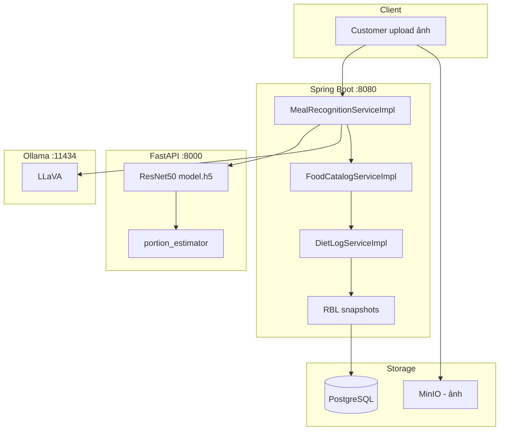
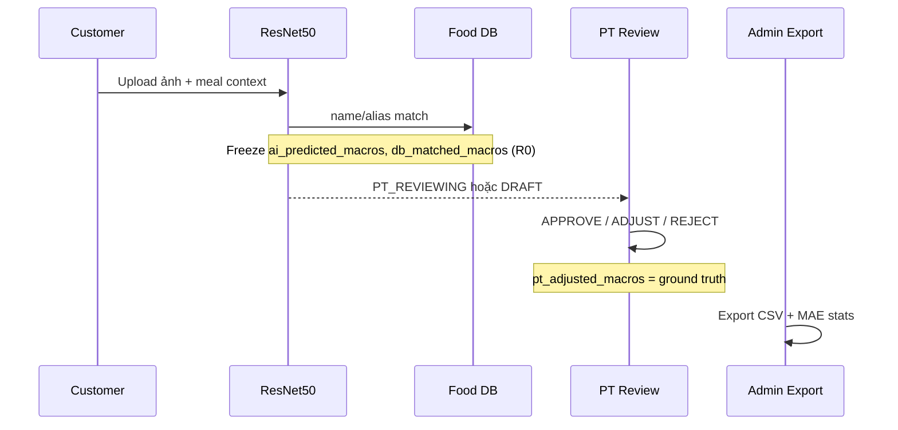

# Báo Cáo Research Hiện Tại — NutriCan PT

> **Tài liệu tổng hợp** về hướng nghiên cứu (20% đồ án) và trạng thái triển khai AI tính đến **27/06/2026**.  
> Dùng làm nguồn tham chiếu chính khi viết báo cáo, luận văn hoặc trình bày tiến độ nhóm.

**Tài liệu liên quan:**

| File | Nội dung |
|------|----------|
| [RESEARCH.md](../RESEARCH.md) | Tổng quan CV + ResNet50 |
| [KE_HOACH.md](./KE_HOACH.md) | RQ, giả thuyết H1–H4 |
| [LO_TRINH.md](./LO_TRINH.md) | Lộ trình G0–G5 |
| [RBL_METHODOLOGY.md](../RBL_METHODOLOGY.md) | Pipeline ground truth |
| [BIEN_BAN_AI_MODULE.md](./BIEN_BAN_AI_MODULE.md) | Mapping biên bản bàn giao |

---

## Mục lục

1. [Tổng quan dự án](#1-tổng-quan-dự-án)
2. [Định vị nghiên cứu](#2-định-vị-nghiên-cứu)
3. [Vấn đề nghiên cứu](#3-vấn-đề-nghiên-cứu)
4. [Câu hỏi nghiên cứu & giả thuyết](#4-câu-hỏi-nghiên-cứu--giả-thuyết)
5. [Kiến trúc kỹ thuật](#5-kiến-trúc-kỹ-thuật)
6. [Dataset & tài sản dữ liệu](#6-dataset--tài-sản-dữ-liệu)
7. [Phương pháp RBL (Research Baseline Layer)](#7-phương-pháp-rbl-research-baseline-layer)
8. [Lộ trình thực hiện & trạng thái hiện tại](#8-lộ-trình-thực-hiện--trạng-thái-hiện-tại)
9. [Scripts & công cụ phân tích](#9-scripts--công-cụ-phân-tích)
10. [Related Work & khung lý thuyết](#10-related-work--khung-lý-thuyết)
11. [Hạn chế & rủi ro](#11-hạn-chế--rủi-ro)
12. [Đạo đức & tái lập kết quả](#12-đạo-đức--tái-lập-kết-quả)
13. [Deliverables & việc còn lại](#13-deliverables--việc-còn-lại)
14. [Hướng dẫn chạy thí nghiệm](#14-hướng-dẫn-chạy-thí-nghiệm)
15. [Dàn ý báo cáo / luận văn](#15-dàn-ý-báo-cáo--luận-văn)

---

## 1. Tổng quan dự án

**NutriCan PT** là nền tảng theo dõi dinh dưỡng tích hợp AI, kết nối người dùng (Customer) với Huấn luyện viên cá nhân (PT), hỗ trợ ghi nhận bữa ăn, phân tích macro, marketplace PT và hệ thống SOS khi AI không chắc chắn.

### 1.1 Phạm vi hai lớp

| Lớp | Mục tiêu | Trạng thái |
|-----|----------|------------|
| **Sản phẩm (80%)** | Ứng dụng web full-stack: auth, KYC, diet tracker, PT workspace, admin | Đã triển khai core |
| **Nghiên cứu (20%)** | Đánh giá nhận diện món Việt + cải thiện ước lượng dinh dưỡng qua grounding Food DB | Đang thu thập & phân tích |

### 1.2 Công nghệ chính

| Thành phần | Công nghệ |
|------------|-----------|
| Backend | Spring Boot 4.0.6, Java 17, PostgreSQL, MinIO, Redis |
| Frontend | React 19.2.6, Vite, Zustand, Radix UI |
| AI nhận diện | ResNet50 (`best_resnet50_model.h5`) qua FastAPI |
| AI bổ trợ | LLaVA (Ollama local) — fusion với ResNet |
| Bảng dinh dưỡng | NutriHome (333 món extract từ PDF) + VTN Food DB (~526 món) |
| Ground truth | PT review qua pipeline RBL |

### 1.3 Cấu trúc repo

```
nutrican/
├── nutrican-be/          # Spring Boot — 8 module
├── nutrican-fe/          # React frontend
├── research/             # AI service, scripts, seed, dataset
│   ├── ai-service/       # FastAPI ResNet50
│   ├── scripts/          # eval, RBL, seed, train
│   ├── seed/resnet10/    # 30 ảnh + 3 negative
│   └── output/           # Kết quả thí nghiệm
└── docs/                 # Tài liệu kỹ thuật + research
```

---

## 2. Định vị nghiên cứu

### 2.1 Level đề tài

- **Improve (2.2):** Cải thiện ước lượng dinh dưỡng bằng cách **grounding** kết quả CNN vào Food Database thay vì dùng macro giả lập trực tiếp.
- **Apply:** Đo offline Top-1 accuracy, calibration trên Vietnamese_Food_Dataset.

### 2.2 Tên đề xuất

> *"Nhận diện món ăn Việt bằng ResNet50 và cải thiện ước lượng dinh dưỡng qua grounding Food-DB: đánh giá bằng nhãn chuyên gia (PT)."*

### 2.3 Claim chính

Giả thuyết cốt lõi: **ΔA > 0**, trong đó:

```
ΔA = MAE(A1.0) − MAE(A1.1)
```

- **A1.0:** Macro từ CNN + bảng `MACRO_DATABASE` giả lập (FastAPI)
- **A1.1:** Macro sau khi map `food_code` → `food_items` (VTN + 10 món ResNet)
- **Ground truth:** Nhãn PT (`pt_adjusted_macros`) qua RBL

### 2.4 Hai nhánh Related Work

1. **Food recognition:** Bohlol et al. (2025) — ResNet50 refined FC, transfer learning, augmentation (97.25% / 16 lớp).
2. **Calorie estimation:** Jelodar & Sun (2021) — decomposition (ingredient + portion) vượt direct estimation (MAE 279.4 vs 394.5 kcal trên Recipe1M).

---

## 3. Vấn đề nghiên cứu

### 3.1 Thách thức

Ước lượng dinh dưỡng từ ảnh món ăn Việt Nam gặp khó vì:

- **Đa dạng món và cách trình bày:** Cùng một món (ví dụ cơm tấm) có nhiều biến thể topping.
- **Phạm vi MVP hẹp:** CNN chỉ cover **10 class** trong scope nghiên cứu.
- **Macro giả lập:** Bảng `MACRO_DATABASE` trong biên bản bàn giao chưa thay thế đầy đủ VTN_FCT_2007.
- **Confidence thấp:** Model thường trả 25–40% do class imbalance.

### 3.2 Giải pháp NutriCan

| Bước | Mô tả |
|------|-------|
| 1 | ResNet50 phân loại 10 món → `food_code` + confidence |
| 2 | Hybrid CV→DB: map tên món vào `food_items` |
| 3 | PT review làm ground truth (RBL) |
| 4 | Snapshot bất biến (R0) để đo MAE, ΔA |

### 3.3 Ánh xạ khái niệm nghiên cứu

| Khái niệm | Ý nghĩa | Field CSV |
|-----------|---------|-----------|
| **A1.0** | CNN + macro giả lập | `ai_cal`, `ai_pro`, `ai_carb`, `ai_fat` |
| **A1.1** | Grounding Food DB | `db_cal`, `db_pro`, `db_carb`, `db_fat` |
| Ground truth | PT APPROVE/ADJUST | `pt_cal`, `pt_pro`, `pt_carb`, `pt_fat` |
| **ΔA** | Cải thiện nhờ grounding | `mean(delta_ai_cal) − mean(delta_db_cal)` |

---

## 4. Câu hỏi nghiên cứu & giả thuyết

### 4.1 Research Questions (RQ)

| ID | Câu hỏi | Metric | Script |
|----|---------|--------|--------|
| **RQ1** | ResNet50 nhận diện đúng bao nhiêu % trên 10 món Việt? | Top-1, per-class F1, confusion matrix | `eval_resnet50.py` |
| **RQ2** | Confidence 25–40% có phản ánh khả năng phân loại? | Calibration buckets | `resnet50_calibration.py` |
| **RQ3** | Macro A1.0 sai bao nhiêu so với nhãn PT? | MAE cal/P/C/F | `rbl_analyze.py` |
| **RQ4** | Grounding `food_code` → `food_items` có giảm sai số? | ΔA, Wilcoxon paired | `rbl_analyze.py` |

### 4.2 Giả thuyết (H1–H4)

| H | Phát biểu | Kỳ vọng |
|---|-----------|---------|
| **H1** | MAE(A1.1) < MAE(A1.0) | ΔA > 0 |
| **H2** | ΔA lớn hơn khi `db_match_score` cao | Bucket high < low |
| **H3** | Top-1 cao trên ảnh in-class, thấp trên negative | WRONG_FOOD rate cao với ảnh ngoài 10 class |
| **H4** | Confidence bucket cao → accuracy cao hơn | Calibration slope dương |

### 4.3 Quyết định rẽ nhánh (sau G4)

```
Nếu ΔA > 0 và Wilcoxon p < 0.05
  → Giữ level Improve, viết Results theo bảng Paper 1 Table IV

Nếu ΔA ≤ 0 hoặc không significant
  → Hạ xuống Apply: báo cáo MAE A1.0 trên món Việt + giải thích
    (DB ~60 món, match yếu, scaling) — cùng dataset, không phí công
```

---

## 5. Kiến trúc kỹ thuật

### 5.1 Pipeline tổng thể



### 5.2 ResNet50 — 10 class (thứ tự alphabet, bắt buộc)

```
banh_chung, banh_khot, banh_mi, banh_trang_nuong, banh_xeo,
bun_dau_mam_tom, ca_kho_to, com_tam, goi_cuon, pho
```

| Tham số | Giá trị |
|---------|--------|
| Model file | `research/best_resnet50_model.h5` (~96 MB, không trong git) |
| `modelVersion` | `resnet50-vtn-10class` (phase1) hoặc `resnet50-vtn-10class-phase2` |
| Input | RGB 224×224, `resnet50.preprocess_input` |
| Confidence threshold | **0.25** (`ai.resnet.confidence-threshold`) |
| Default portion | 100g (limitation — CNN không estimate portion trực tiếp) |
| API | `POST /api/v1/analyze-food` (multipart `file`) |

### 5.3 Fusion ResNet + LLaVA + NutriHome (production)

Ngoài track nghiên cứu RBL thuần A1.0/A1.1, codebase hiện tại có **lớp fusion** cho trải nghiệm người dùng:

1. **ResNet50** → `food_code`, confidence, top-3, `portion_ratio` (ước lượng từ diện tích ảnh)
2. **LLaVA** (Ollama) → tên món, gram ước lượng — sửa nhầm lẫn (ví dụ cơm tấm vs bánh khọt)
3. **MealAnalysisFusion** → hợp nhất kết quả
4. **NutriHomeCatalog** → macro × gram thực tế (333 món từ PDF)

> **Lưu ý cho báo cáo:** Phần nghiên cứu 20% vẫn đo **A1.0 vs A1.1** từ snapshot R0 (`ai_predicted_macros` vs `db_matched_macros`). Fusion LLaVA là cải tiến sản phẩm, không thay thế metric RBL cốt lõi.

### 5.4 Hybrid CV → Food DB

```
ResNet food_code
    → ResNetFoodCodeMapping.nameVi
    → FoodCatalogService.findBestMatch
    → db_matched_macros (snapshot)
    → nếu confidence ≥ threshold + match: recognition_source = HYBRID
```

**Match scoring** (`FoodCatalogServiceImpl`):

| Target | Điểm nếu `contains(query)` |
|--------|------------------------------|
| `name_vi` | +10 |
| `name_en` | +8 |
| Mỗi alias trong JSONB | +6 |

**Portion scaling** (khi hybrid áp dụng):

```
portion = portionSize ?? food.serving_size_g
macros = food.macros × (portion / serving_size_g)
```

### 5.5 Module backend liên quan

| Module | Vai trò research |
|--------|------------------|
| `nutritiontrack-module-ai-gateway` | `ResNetFoodRecognitionClient`, `MealRecognitionServiceImpl`, fusion |
| `nutritiontrack-module-diet-tracker` | `DietLogServiceImpl`, hybrid logic, cohort |
| `nutritiontrack-module-admin` | RBL export, stats, dashboard |
| `nutritiontrack-module-pt-management` | PT review, blind estimate, SSE |

### 5.6 UI liên quan nghiên cứu

| Route | Vai trò |
|-------|---------|
| `/diet` | Customer upload ảnh + meal context |
| `/pt/reviews` | PT review, blind mode, RBL stats |
| `/admin` | RBL dashboard, export CSV/report |

---

## 6. Dataset & tài sản dữ liệu

### 6.1 Tài sản bàn giao (Biên bản AI Module)

| Tài sản | Vị trí | Ghi chú |
|---------|--------|---------|
| Model ResNet50 | `research/best_resnet50_model.h5` | ~96 MB |
| Dataset 10 class | `research/Vietnamese_Food_Dataset/` | ~**8.705 ảnh** (không phải ~300/class như biên bản ghi) |
| Paper Bohlol 2025 | `research/Improved food recognition...pdf` | Related Work |
| NutriHome PDF extract | `research/data/nutrihome_foods.json` | **333 món** |
| ResNet10 per 100g | `research/data/nutrihome_resnet10_per100g.json` | Macro 10 món ResNet |

**Per-class (ước lượng):** `com_tam` ~936 ảnh, `pho` ~801 ảnh.

### 6.2 Dataset offline (RQ1/RQ2)

- **Nguồn:** Vietnamese_Food_Dataset
- **Split:** 80/20 stratified, seed = 42
- **Output:** `research/output/resnet50_eval.json` + `.md`

### 6.3 Dataset RBL (RQ3/RQ4)

| Cohort | Target min | Trạng thái seed |
|--------|------------|----------------|
| `HOME_HYBRID_DB` | ≥8 | **12** ✅ |
| `RESTAURANT_*` | ≥8 | **8** ✅ |
| `HOTPOT_HYBRID` | ≥4 | **1** ⚠️ (thiếu 3 nếu strict SOP) |
| `COMPOSITE_BUFFET` | ≥4 | **4** ✅ |
| `HOME_AI_ONLY` (mix) | — | **5** |
| **Tổng** | **≥30** | **30/30** ✅ |

**Seed ResNet10:** `research/seed/resnet10/` — 30 ảnh in-class + 3 negative (`negative_01.png` …)

### 6.4 Food Database

| Phiên bản | Quy mô | Dùng cho |
|-----------|--------|----------|
| `v2-60` | ~60 món (header CSV) | RBL export metadata |
| VTN + ResNet10 | ~526 + 10 món | Hybrid matching runtime |
| NutriHome | 333 món | Macro LLaVA fusion |

---

## 7. Phương pháp RBL (Research Baseline Layer)

### 7.1 Luồng pipeline



> **Quan trọng:** SOS ticket resolution **không** tạo ground truth. Chỉ `reviewLog` actions mới là nhãn.

### 7.2 Quy tắc snapshot (R0)

| Snapshot | Thời điểm set | Không được thay đổi sau |
|----------|---------------|-------------------------|
| `ai_predicted_macros` | `analyzeMeal` | Không ghi đè bởi hybrid/PT |
| `db_matched_macros` | `analyzeMeal` | Lưu cả khi `db_applied=false` |
| `macros_at_review` | Bắt đầu `reviewLog` | Trước khi PT sửa |
| `pt_adjusted_macros` | APPROVE/ADJUST | Nhãn cuối cùng |
| `pt_blind_macros` | Blind estimate (tùy chọn) | Ước lượng PT trước khi thấy AI/DB |

### 7.3 Định nghĩa MAE

```
MAE_calories = mean(|ai_predicted_macros.calories - pt_adjusted_macros.calories|)
```

- **Baseline:** `ai_predicted_macros` (không dùng `macros_json` — có thể đã reflect hybrid)
- **Label:** `pt_adjusted_macros`
- **Bao gồm:** APPROVE + ADJUST_MACROS
- **Loại trừ:** REJECT, MANUAL (khi `cvOnly=true`), legacy logs không có snapshot

### 7.4 Experiment cohorts

| Cohort | Điều kiện |
|--------|------------|
| `HOME_HYBRID_DB` | `HOME_COOKED` + `HYBRID` |
| `RESTAURANT_AI_ONLY` | Ăn ngoài + `AI_ONLY` |
| `RESTAURANT_HYBRID_DB` | Ăn ngoài + `HYBRID` |
| `HOTPOT_HYBRID` | `mealComplexity = HOTPOT` |
| `COMPOSITE_BUFFET` | `mealComplexity = COMPOSITE` |
| `AI_ONLY_BASELINE` | `AI_ONLY`, home/simple |
| `MANUAL_ENTRY` | Nhập tay |

### 7.5 Export CSV

**Endpoint:** `GET /api/v1/admin/rbl/export?cvOnly=true&includeRejected=false`

Cột quan trọng: `ai_cal`, `db_cal`, `pt_cal`, `delta_ai_cal`, `delta_db_cal`, `db_match_score`, `experiment_cohort`, `model_version`, `recognition_source`, `ai_portion_g`, `db_applied`.

Chi tiết đầy đủ: [RBL_METHODOLOGY.md](../RBL_METHODOLOGY.md) §6.

---

## 8. Lộ trình thực hiện & trạng thái hiện tại

### 8.1 Sáu giai đoạn (G0–G5)

```
G0: Xác minh kỹ thuật ──┐
                        ├──► G2: Thu dữ liệu ──► G3: PT label ──► G4: Phân tích ──► G5: Viết báo cáo
G1: Literature review ──┘
```

### 8.2 Bảng trạng thái (cập nhật 27/06/2026)

| Giai đoạn | Mô tả | Trạng thái | Ghi chú |
|-----------|-------|------------|---------|
| **G0** | Xác minh pipeline ResNet → RBL | ✅ Hoàn thành | Scaling OK; smoke test pass |
| **G1** | Literature review (Paper 1 + Bohlol) | 🔄 Đang làm | Bảng [LITERATURE_MAP.md](./LITERATURE_MAP.md) có draft |
| **G2** | Thu ≥30 snapshot R0 | ✅ Hoàn thành | 30/30 seed; thiếu 3 ảnh HOTPOT nếu strict |
| **G3** | PT labeling | ✅ Dev seed | 30/30 auto-label; cần label PT thật cho báo cáo |
| **G4** | Export + phân tích ΔA | ⏳ Sẵn sàng | Chưa có export labeled ≥30 từ môi trường live |
| **G5** | Viết báo cáo/luận văn | ⏳ Chờ G4 | Dàn ý sẵn tại [THESIS_OUTLINE.md](./THESIS_OUTLINE.md) |

### 8.3 Deliverables đã hoàn thành

- [x] FastAPI `research/ai-service/`
- [x] Spring `ResNetFoodRecognitionClient` + `MealRecognitionServiceImpl`
- [x] Fusion ResNet + LLaVA + NutriHome
- [x] NutriHome extract 333 món + sync classpath
- [x] Offline eval scripts (`eval_resnet50.py`, `resnet50_calibration.py`)
- [x] RBL seed ≥30 ảnh + manifest (`research/seed/resnet10/`)
- [x] Script train Phase 2 (`train_resnet50_phase2.py`) — **chưa chạy full**
- [x] Admin RBL export/stats/report API
- [x] G0 verification checklist

### 8.4 Việc chưa hoàn thành

- [ ] Kết quả offline eval trên máy Python 3.10–3.12 (TensorFlow)
- [ ] Fine-tune ResNet Phase 2 full (com_tam/pho focus)
- [ ] Export RBL thật sau PT label live (không chỉ dev auto-label)
- [ ] Điền [RESULTS_TEMPLATE.md](./RESULTS_TEMPLATE.md) với số liệu thật
- [ ] Blind estimate ~30% log (manifest gợi ý 4 ảnh)
- [ ] Ghi thông tin PT labeler (tên, kinh nghiệm) cho Ethics
- [ ] Bổ sung 3 ảnh HOTPOT nếu cần đạt SOP strict

---

## 9. Scripts & công cụ phân tích

### 9.1 Bảng script

| Script | Mục đích | Output |
|--------|----------|--------|
| `eval_resnet50.py` | Offline Top-1, confusion matrix (RQ1) | `output/resnet50_eval.json` |
| `resnet50_calibration.py` | Accuracy theo confidence bucket (RQ2) | `output/resnet50_calibration.json` |
| `resnet50_smoke_test.py` | G0 end-to-end | Console pass/fail |
| `prepare_resnet_rbl_seed.py` | Tạo 30 ảnh + 3 negative | `seed/resnet10/` |
| `seed_resnet_rbl.py` | Upload + PT label qua API | DB logs |
| `rbl_analyze.py` | MAE A1.0 vs A1.1, ΔA, Wilcoxon | Console + JSON |
| `fill_results_template.py` | Auto-fill RESULTS_TEMPLATE | Markdown bảng |
| `train_resnet50_phase2.py` | Fine-tune ResNet Phase 2 | `best_resnet50_model_phase2.h5` |
| `extract_nutrihome_pdf.py` | Extract macro từ PDF | `data/nutrihome_foods.json` |

### 9.2 Phụ thuộc Python

| Yêu cầu | Ghi chú |
|---------|---------|
| Python **3.10 – 3.12** | Python 3.14 **chưa** có TensorFlow |
| TensorFlow 2.x | `research/ai-service/requirements.txt` |
| pandas, scipy | `research/scripts/requirements.txt` (cho `rbl_analyze.py`) |

### 9.3 Batch chạy nhanh (Windows)

```powershell
# Menu chính
research\run-ai.bat

# Hoặc từng bước:
research\run-setup.bat          # Lần đầu
research\run-ai-service.bat       # FastAPI :8000
research\run-train-phase2.bat     # Fine-tune (tùy chọn)
```

---

## 10. Related Work & khung lý thuyết

### 10.1 Bốn nhánh (theo Paper 1 — Jelodar & Sun, arXiv 2112.09839)

| Nhánh | Vai trò NutriCan | Paper tiêu biểu |
|-------|------------------|-----------------|
| **A. Dish Classification** | ResNet50 10 món Việt | Bohlol 2025, Ng 2019 |
| **B. Ingredient Recognition** | **Out of scope** — không sinh ingredient list | Salvador — Inverse Cooking (CVPR 2019) |
| **C. Portion Estimation** | Rule `portion/serving_size_g` | Myers — Im2Calories, Paper 1 Table III |
| **D. Calorie Estimation** | **Cốt lõi** — A1.0 vs A1.1 | Jelodar & Sun 2021 |

### 10.2 Mốc so sánh Paper 1 (Recipe1M — chỉ tham chiếu độ lớn)

| Model | MAE (kcal) | MAE% |
|-------|------------|------|
| Tcalorie (direct) | 394.5 | 49.9% |
| CNN baseline | 380 | 49.8% |
| **Tupc (decomposition)** | **279.4** | **37.5%** |
| Δ (direct − decomposition) | ≈115 kcal | — |

> NutriCan dùng dataset món Việt + nhãn PT — **không claim beat Paper 1** về số tuyệt đối.

### 10.3 Điểm khác biệt NutriCan vs Paper 1

| Paper 1 | NutriCan |
|---------|----------|
| Train transformer sinh ingredient | ResNet50 classifier + Food DB lookup |
| Ground truth từ Recipe1M parsed | Ground truth từ PT review (RBL) |
| Dataset Recipe1M (1M recipes) | Vietnamese_Food_Dataset + RBL cohort |
| Portion qua 6 unit types | Portion rule-based / LLaVA estimate |

---

## 11. Hạn chế & rủi ro

### 11.1 Hạn chế kỹ thuật (bắt buộc ghi trong báo cáo)

| Hạn chế | Ảnh hưởng |
|---------|-----------|
| Chỉ **10 món** Việt | Không generalize toàn bộ ẩm thực VN |
| Macro MVP = bảng giả lập | MAE A1.0 cao vs PT thật |
| Confidence thấp (25–40%) | Nhiều log DRAFT nếu threshold cao |
| Không estimate portion từ CNN | Default 100g; portion_ratio là heuristic |
| Input 224×224 | Paper Bohlol dùng 340×640 |
| TF cần Python ≤3.12 | Dev env phải pin version |

### 11.2 Hạn chế phương pháp

| Hạn chế | Mitigation |
|---------|------------|
| Ground truth = ý kiến PT | Ghi kinh nghiệm labeler; blind mode ~30% |
| Food DB ~60 món (v2-60) | Báo `db_match_score` distribution |
| Mẫu nhỏ (n<30) | `insufficientSample=true` — báo preliminary |
| Ảnh max 500KB | Acknowledge trong Methods |
| Domain chỉ tiếng Việt | Scope statement trong Introduction |

### 11.3 Rủi ro nếu ΔA ≤ 0

Giải thích trung thực:

1. Catalog coverage quá nhỏ cho đa dạng nhà hàng
2. Name normalization mismatch (tiếng Anh vs tiếng Việt)
3. Portion estimation vẫn noisy dù đã scale DB
4. Sample size / cohort imbalance

→ Vẫn valid để **benchmark A1.0 trên món Việt** (level Apply).

---

## 12. Đạo đức & tái lập kết quả

### 12.1 Nguyên tắc

| Nguyên tắc | Cách tuân thủ |
|------------|---------------|
| Không ma số liệu | MAE/ΔA từ CSV export thật |
| Báo cáo kết quả xấu | ΔA ≤ 0 vẫn publish + giải thích |
| Ground truth minh bạch | Chỉ từ PT review, không SOS |
| Privacy | CSV chỉ `customer_id_hash` |
| Consent | Thông báo participant data dùng cho nghiên cứu |

### 12.2 Checklist reproducibility

- [x] `model_version` — `resnet50-vtn-10class`
- [ ] `prompt_version` — hash tại thời điểm thu
- [x] `food_db_version` — `v2-60` (header CSV)
- [ ] Khoảng thời gian thu (`from`, `to`)
- [ ] Số mẫu labeled CV (`totalLabeledCv`, `insufficientSample`)
- [x] Filter: `cvOnly=true`, `includeRejected=false`
- [ ] Git commit hash tại lúc thu data
- [ ] Thông tin PT labeler

---

## 13. Deliverables & việc còn lại

### 13.1 Bảng ưu tiên ngắn hạn

| Ưu tiên | Việc | Người | Ước lượng |
|---------|------|-------|-----------|
| P0 | Chạy `eval_resnet50.py` trên Python 3.12 | Dev AI | 1–2 giờ |
| P0 | PT label thật 30 log (hoặc re-seed live) | PT + Dev | 1 tuần |
| P1 | Export CSV + `rbl_analyze.py` | Dev | 1 ngày |
| P1 | Điền RESULTS_TEMPLATE | Viết báo cáo | 2–3 ngày |
| P2 | Fine-tune Phase 2 + so sánh before/after | Dev AI | 1–2 ngày |
| P2 | Bổ sung 3 ảnh HOTPOT | Team thu data | 1 buổi |

### 13.2 Mục tiêu độ chính xác sản phẩm (≥80% calo)

Theo [NUTRIHOME_ASSETS_CHECKLIST.md](./NUTRIHOME_ASSETS_CHECKLIST.md):

1. Chạy fine-tune ResNet Phase 2 (đặc biệt com_tam/pho)
2. Ollama LLaVA luôn bật khi demo
3. Đánh giá offline trước/sau Phase 2
4. RBL cohort 30+ ảnh thật + PT label đo MAE kcal
5. Xác nhận macro **cá kho tộ** (PDF không có "1 tộ")

---

## 14. Hướng dẫn chạy thí nghiệm

### 14.1 Khởi động môi trường

```powershell
# Terminal 1 — Infrastructure
cd nutrican-be
docker-compose up -d
./mvnw spring-boot:run

# Terminal 2 — AI service (Python 3.10–3.12)
research\run-ai-service.bat

# Terminal 3 (tùy chọn) — Ollama LLaVA
ollama pull llava
ollama serve

# Terminal 4 — Frontend
cd nutrican-fe
npm install && npm run dev
```

### 14.2 G0 smoke test

```powershell
python research/scripts/resnet50_smoke_test.py
```

Kiểm tra: [G0_VERIFICATION.md](./G0_VERIFICATION.md) — 5 mục (RBL snapshots, scaling, CSV columns, hybrid/fallback, offline eval).

### 14.3 Offline classification (RQ1/RQ2)

```powershell
python research/scripts/eval_resnet50.py
python research/scripts/resnet50_calibration.py
```

### 14.4 Thu & label RBL (RQ3/RQ4)

```powershell
# Tạo lại seed (nếu cần)
python research/scripts/prepare_resnet_rbl_seed.py

# Upload + PT label (backend + AI service phải chạy)
python research/scripts/seed_resnet_rbl.py
```

Hoặc thu thủ công qua UI `/diet` theo [DATA_COLLECTION_SOP.md](./DATA_COLLECTION_SOP.md) và label tại `/pt/reviews` theo [PT_LABELING_SOP.md](./PT_LABELING_SOP.md).

### 14.5 Export & phân tích

```powershell
# Export (cần admin token)
curl -H "Authorization: Bearer $TOKEN" ^
  "http://localhost:8080/api/v1/admin/rbl/export?cvOnly=true&includeRejected=false" ^
  -o research/output/rbl_export.csv

# Phân tích
pip install -r research/scripts/requirements.txt
python research/scripts/rbl_analyze.py research/output/rbl_export.csv
python research/scripts/fill_results_template.py research/output/rbl_export.csv
```

---

## 15. Dàn ý báo cáo / luận văn

Theo [THESIS_OUTLINE.md](./THESIS_OUTLINE.md):

| Chương | Nội dung | Viết khi nào |
|--------|----------|--------------|
| 1. Introduction | Vấn đề, gap, đóng góp | Ngay từ đầu |
| 2. Related Work | Literature map 4 nhánh | Sau G1 |
| 3. Method | ResNet50, FastAPI, RBL, A1.0/A1.1 | Sau G0 |
| 4. Experiments | Dataset, cohort, protocol | Sau G2 |
| 5. Results | Bảng MAE, ΔA, calibration | **Sau G4** |
| 6. Limitations | 10 class, macro giả lập, PT bias | Sau G4 |
| 7. Conclusion | Tóm tắt + hướng mở rộng | Cuối |

### 15.1 Bảng kết quả mẫu (điền sau G4)

| Model | Role | MAE (kcal) | MAE% | Paper 1 ref |
|-------|------|------------|------|-------------|
| **A1.0** | CNN + macro giả lập | _fill_ | _fill_ | Tcalorie 394.5 |
| **A1.1** | Hybrid CV→DB | _fill_ | _fill_ | Tupc 279.4 |
| **ΔA** | A1.0 − A1.1 | _fill_ | — | ≈115 kcal |

Template đầy đủ: [RESULTS_TEMPLATE.md](./RESULTS_TEMPLATE.md)

---

## Phụ lục A — 10 class ResNet (chi tiết)

| `food_code` | Tên hiển thị |
|-------------|--------------|
| `banh_chung` | Bánh Chưng |
| `banh_khot` | Bánh Khọt |
| `banh_mi` | Bánh Mì |
| `banh_trang_nuong` | Bánh Tráng Nướng |
| `banh_xeo` | Bánh Xèo |
| `bun_dau_mam_tom` | Bún Đậu Mắm Tôm |
| `ca_kho_to` | Cá Kho Tộ |
| `com_tam` | Cơm Tấm (Cơm sườn) |
| `goi_cuon` | Gỏi Cuốn |
| `pho` | Phở |

## Phụ lục B — API research nhanh

| Endpoint | Vai trò |
|----------|---------|
| `GET /admin/rbl/export` | Download CSV |
| `GET /admin/rbl/export/preview` | Preview count |
| `GET /admin/rbl/stats` | Dashboard metrics |
| `GET /admin/rbl/report` | Markdown report |
| `PUT /workspace/diet-logs/{id}/blind-estimate` | Blind macro entry |

## Phụ lục C — Timeline gợi ý (~5 tuần)

| Tuần | G0 | G1 | G2 | G3 | G4 | G5 |
|------|----|----|----|----|----|-----|
| 1 | ✅ | Bắt đầu | Bắt đầu | | | Intro/Method |
| 2 | | Tiếp | Tiếp | Bắt đầu | | |
| 3 | | Hoàn thành | ≥30 | Tiếp | | Related Work |
| 4 | | | ✅ | Hoàn thành | Chạy script | Experiments |
| 5 | | | | | Hoàn thiện | Results, Conclusion |

---

*Document Version: 1.0.0 | Created: 2026-06-27 | Tác giả: tổng hợp từ docs/research/*
